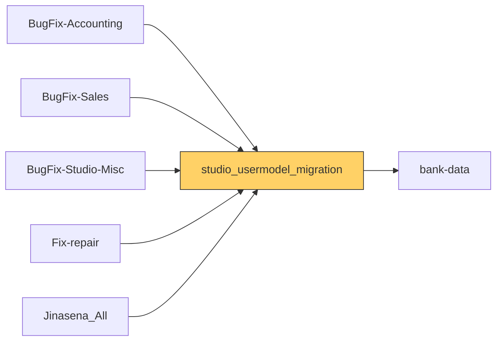

# Functional Documentation — studio_usermodel_migration

> Generated by `scripts/generate_functional_docs.py` from branch `Visual_Migration_02` (commit 50bcd65 2026-10-06) and the installed module on the clean environment. For every attribute: **Function** = what it does, **Depends on** = the attributes it relies on (owning module in brackets when it is not this repo), **Used by** = the attributes in any Jinasena repo that rely on it.

| Item | Value |
|---|---|
| Technical name | `studio_usermodel_migration` |
| Title | Jinasena : Masterdata : User |
| Version | `17.0.1.0.62` |
| Category | Extra Tools |
| License | LGPL-3 |
| Installed on environment | installed 17.0.1.0.62 |
| History | [CHANGELOG.md](CHANGELOG.md) |

## Purpose

<!-- SUMMARY:repo -->
This module holds user settings and customer/vendor classification master data that were originally built in Odoo Studio and have been ported into Python code. Administrators use it to maintain user settings (default stock locations per company, recruitment stages, manufacturing super-user flags) and the Customer Group and Vendor Group catalogues under Sales and Purchase configuration. Contacts carry a Customer Group, Vendor Group and Group Type, which BugFix-Sales and BugFix-Accounting use for payment terms, pricelists and validations, while Fix-repair uses the users' stock locations.

- Customer Group and Vendor Group catalogues with payment term and receivable or payable account, linked contacts, company set automatically, multi-company record rules, and 24 customer and 20 vendor groups seeded on install.
- Customer Group, Vendor Group and Group Type on contacts, also shown on users.
- User form additions: company-dependent Source and Virtual Locations, Recruitment, Manufacturing and Attendance tabs, and a check that blocks setting both super-user flags; many unused Studio leftover fields.
- Admin note fields on automations, access rights and record rules, an access groups list, and an automation that emails when an access group changes.
- The 'Other Extra Rights / Rohana' security group and menus, including Payroll > Configuration > Employee Bank Accounts.
- Install hook and migration scripts that seed the groups and create the res.users columns.
<!-- /SUMMARY -->

## Module dependencies

| Kind | Modules |
|---|---|
| Odoo standard / enterprise | `base`, `hr_recruitment`, `account` |
| Jinasena repos | `bank-data` |
| Third-party apps |  |
| Used by (Jinasena repos that depend on this one) | `BugFix-Accounting`, `BugFix-Sales`, `BugFix-Studio-Misc`, `Fix-repair`, `Jinasena_All` |



## Contents at a glance

| Attribute type | Count |
|---|---|
| Models created | 2 |
| Models extended | 11 |
| Fields | 146 |
| Python methods | 5 |
| Views | 13 |
| Window actions | 2 |
| Server actions | 5 |
| Automations | 3 |
| Menus | 7 |
| Mail templates | 2 |
| Security groups | 1 |
| Access rights | 8 |
| Record rules | 4 |
| Install hooks | 4 |
| Migration scripts | 7 |

## Models

| Model | Description | Created / extends | Fields | Views | Actions + automations | Approvals |
|---|---|---|---|---|---|---|
| `account.move` | Journal Entry | extends (account) | 0 | 0 | 0 | 0 |
| `account.move.line` | Journal Item | extends (account) | 0 | 0 | 0 | 0 |
| `base.automation` | Automation Rule | extends (base_automation) | 2 | 0 | 0 | 0 |
| `ir.model.access` | Model Access | extends (base) | 2 | 0 | 0 | 0 |
| `ir.rule` | Rule | extends (base) | 1 | 0 | 0 | 0 |
| `res.groups` | Access Groups | extends (base) | 0 | 2 | 2 | 0 |
| `res.partner` | Contact | extends (base) | 3 | 0 | 0 | 0 |
| `res.users` | User | extends (base) | 59 | 2 | 0 | 0 |
| `sale.order.line` | Sales Order Line | extends (sale) | 0 | 0 | 0 | 0 |
| `x_customer_group` | Customer Group | created | 40 | 4 | 3 | 0 |
| `x_sales_report_model` | Sales Report Model | extends (Jinasena_Masterdata_Reporting) | 0 | 0 | 0 | 0 |
| `x_sales_report_type` | Sales Report Type | extends (Jinasena_Masterdata_Reporting) | 0 | 0 | 0 | 0 |
| `x_vendor_group` | Vendor Group | created | 39 | 5 | 3 | 0 |

### `account.move` — Journal Entry

*Extends a model created by `account`.* Python: `models/account_move.py`.

Other repos that use this model: `access right BugFix-Accounting.access_6858_account_move` (BugFix-Accounting)<br>`account.bank.statement.line.x_studio_created_from_vendor_bill_1` (BugFix-Accounting)<br>`account.bank.statement.line.x_studio_created_from_vendor_bill` (BugFix-Accounting)<br>`account.bank.statement.line.x_studio_many2one_field_6HjHy` (BugFix-Accounting)<br>`account.bank.statement.line.x_studio_many2one_field_ffAE3` (BugFix-Accounting)<br>`account.bank.statement.line.x_studio_many2one_field_mULOh` (BugFix-Accounting)<br>`account.bank.statement.line.x_studio_many2one_field_xkSx5` (BugFix-Accounting)<br>`account.move._bugfix_purchase_auto_reconcile_cp()` (BugFix-Purchase)<details><summary>+198 more</summary>`account.move._compute_vendor_bill_1_count()` (BugFix-Accounting)<br>`account.move._compute_vendor_bill_count()` (BugFix-Accounting)<br>`account.move._rug_auto_settle()` (Fix-repair)<br>`account.move.line.x_studio_journal` (BugFix-Accounting)<br>`account.move.x_studio_created_from_vendor_bill_1` (BugFix-Accounting)<br>`account.move.x_studio_created_from_vendor_bill` (BugFix-Accounting)<br>`account.payment.x_studio_created_from_vendor_bill_1` (BugFix-Accounting)<br>`account.payment.x_studio_created_from_vendor_bill` (BugFix-Accounting)<br>`account.payment.x_studio_many2one_field_6HjHy` (BugFix-Accounting)<br>`account.payment.x_studio_many2one_field_ffAE3` (BugFix-Accounting)<br>`account.payment.x_studio_many2one_field_mULOh` (BugFix-Accounting)<br>`account.payment.x_studio_many2one_field_xkSx5` (BugFix-Accounting)<br>`approval rule BugFix-Accounting.ar_final_journal_entry_sls_credit_note_approval_sales_credit_note_app` (BugFix-Accounting)<br>`approval rule BugFix-Accounting.ar_relaxed_journal_entry_sls_overdue_approval_sales_credit_note_approve` (BugFix-Accounting)<br>`automation BugFix-Accounting.automation_115_validate_journals_created_from_cp_npo` (BugFix-Accounting)<br>`automation BugFix-Accounting.automation_121_srm_update_sales_order_customer_invoice` (BugFix-Accounting)<br>`automation BugFix-Accounting.automation_138_supplier_invoice_no_update_in_import_vendor_bill` (BugFix-Accounting)<br>`automation BugFix-Accounting.automation_145_sls_validate_bank_guarantee_in_customer_invoice` (BugFix-Accounting)<br>`automation BugFix-Accounting.automation_170_supplier_invoice_no_update_in_import_vendor_bill_2` (BugFix-Accounting)<br>`automation BugFix-Accounting.automation_215_rr_validate_rug_in_customer_invoice` (BugFix-Accounting)<br>`automation BugFix-Accounting.automation_237_update_analytic_tag_parameters_sales_invoice_customer` (BugFix-Accounting)<br>`automation BugFix-Accounting.automation_328_project_update_project_no_for_manual_transactions` (BugFix-Accounting)<br>`automation BugFix-Accounting.automation_43_work_center_costing_model_update_journal_entries` (BugFix-Accounting)<br>`automation BugFix-Accounting.automation_64_imp_update_consignment_vendor_bill` (BugFix-Accounting)<br>`automation BugFix-Accounting.automation_72_imp_update_lc_status_to_paid` (BugFix-Accounting)<br>`automation BugFix-Accounting.base_automation_115_validate_journals_created_from_cp_npo` (BugFix-Accounting)<br>`automation BugFix-Accounting.base_automation_121_srm_update_sales_order_customer_invoice` (BugFix-Accounting)<br>`automation BugFix-Accounting.base_automation_123_srm_auto_populate_report_type_in_account_move` (BugFix-Accounting)<br>`automation BugFix-Accounting.base_automation_127_sls_validate_payment_in_customer_invoice` (BugFix-Accounting)<br>`automation BugFix-Accounting.base_automation_138_supplier_invoice_no_update_in_import_vendor_bill` (BugFix-Accounting)<br>`automation BugFix-Accounting.base_automation_145_sls_validate_bank_guarantee_in_customer_invoice` (BugFix-Accounting)<br>`automation BugFix-Accounting.base_automation_170_supplier_invoice_no_update_in_import_vendor_bill_2` (BugFix-Accounting)<br>`automation BugFix-Accounting.base_automation_215_rr_validate_rug_in_customer_invoice` (BugFix-Accounting)<br>`automation BugFix-Accounting.base_automation_237_update_analytic_tag_parameters_sales_invoice_customer` (BugFix-Accounting)<br>`automation BugFix-Accounting.base_automation_238_update_analytic_tag_parameters_sales_invoice_user` (BugFix-Accounting)<br>`automation BugFix-Accounting.base_automation_328_project_update_project_no_for_manual_transactions` (BugFix-Accounting)<br>`automation BugFix-Accounting.base_automation_338_pr_validate_cash_issued_in_npo` (BugFix-Accounting)<br>`automation BugFix-Accounting.base_automation_43_work_center_costing_model_update_journal_entries` (BugFix-Accounting)<br>`automation BugFix-Accounting.base_automation_64_imp_update_consignment_vendor_bill` (BugFix-Accounting)<br>`automation BugFix-Accounting.base_automation_72_imp_update_lc_status_to_paid` (BugFix-Accounting)<br>`record rule BugFix-Accounting.rule_142_purchase_user_account_move` (BugFix-Accounting)<br>`record rule BugFix-Accounting.rule_172_personal_invoices` (BugFix-Accounting)<br>`record rule BugFix-Accounting.rule_173_all_invoices` (BugFix-Accounting)<br>`record rule BugFix-Accounting.rule_634_expense_team_approver_account_move` (BugFix-Accounting)<br>`record rule BugFix-Accounting.rule_637_point_of_sale_account_move` (BugFix-Accounting)<br>`record rule BugFix-Accounting.rule_776_invoice_pos_user` (BugFix-Accounting)<br>`record rule BugFix-Accounting.rule_77_account_entry` (BugFix-Accounting)<br>`record rule BugFix-Accounting.rule_93_all_journal_entries` (BugFix-Accounting)<br>`record rule BugFix-Accounting.rule_95_portal_personal_account_invoices` (BugFix-Accounting)<br>`record rule BugFix-Accounting.rule_97_readonly_move` (BugFix-Accounting)<br>`record rule BugFix-Accounting.rule_99_readonly_move` (BugFix-Accounting)<br>`report BugFix-Accounting.action_report_journal_entry_1` (BugFix-Accounting)<br>`report BugFix-Accounting.action_report_journal_entry_2` (BugFix-Accounting)<br>`report BugFix-Accounting.action_report_pro_forma_invoice` (BugFix-Accounting)<br>`sale.order._create_repair_full_invoice()` (Fix-repair)<br>`sale.order.write()` (Fix-repair)<br>`server action BugFix-Accounting.sa_f5_account_move_project_update_project_no_for_manual_transactions` (BugFix-Accounting)<br>`server action BugFix-Accounting.sa_f5_account_move_rr_validate_rug_in_customer_invoice` (BugFix-Accounting)<br>`server action BugFix-Accounting.sa_f5_account_move_sls_validate_bank_guarantee_in_customer_invoice` (BugFix-Accounting)<br>`server action BugFix-Accounting.sa_f5_account_move_sls_validate_payment_in_customer_invoice` (BugFix-Accounting)<br>`server action BugFix-Accounting.sa_f5_account_payment_update_project_no_in_journal_entry` (BugFix-Accounting)<br>`server action BugFix-Accounting.server_action_1144_work_center_costing_model_update_journal_entries` (BugFix-Accounting)<br>`server action BugFix-Accounting.server_action_1368_imp_update_consignment_vendor_bill` (BugFix-Accounting)<br>`server action BugFix-Accounting.server_action_1370_imp_update_consignment_pi` (BugFix-Accounting)<br>`server action BugFix-Accounting.server_action_1374_imp_testing` (BugFix-Accounting)<br>`server action BugFix-Accounting.server_action_1384_imp_post_tp_invoice` (BugFix-Accounting)<br>`server action BugFix-Accounting.server_action_1396_imp_update_consignment_vendor_bill` (BugFix-Accounting)<br>`server action BugFix-Accounting.server_action_1408_imp_update_lc_status_to_paid` (BugFix-Accounting)<br>`server action BugFix-Accounting.server_action_1441_test_22` (BugFix-Accounting)<br>`server action BugFix-Accounting.server_action_1489_sls_request_credit_note_approval_sent` (BugFix-Accounting)<br>`server action BugFix-Accounting.server_action_1491_sls_request_credit_note_approval_notify_user` (BugFix-Accounting)<br>`server action BugFix-Accounting.server_action_1493_sls_request_credit_note_approval` (BugFix-Accounting)<br>`server action BugFix-Accounting.server_action_1495_sls_credit_note_approval_main` (BugFix-Accounting)<br>`server action BugFix-Accounting.server_action_1519_sls_payment_reconciliation_automate` (BugFix-Accounting)<br>`server action BugFix-Accounting.server_action_1720_validate_journals_created_from_cp_npo` (BugFix-Accounting)<br>`server action BugFix-Accounting.server_action_1733_srm_update_sales_order_customer_invoice` (BugFix-Accounting)<br>`server action BugFix-Accounting.server_action_1740_srm_auto_populate_report_type_in_account_move` (BugFix-Accounting)<br>`server action BugFix-Accounting.server_action_1751_sls_validate_payment_in_customer_invoice` (BugFix-Accounting)<br>`server action BugFix-Accounting.server_action_1766_supplier_invoice_no_update_in_import_vendor_bill` (BugFix-Accounting)<br>`server action BugFix-Accounting.server_action_1775_sls_validate_bank_guarantee_in_customer_invoice` (BugFix-Accounting)<br>`server action BugFix-Accounting.server_action_1847_supplier_invoice_no_update_in_import_vendor_bill_2` (BugFix-Accounting)<br>`server action BugFix-Accounting.server_action_1851_sls_send_bank_guarantee_notification_in_customer_invoice` (BugFix-Accounting)<br>`server action BugFix-Accounting.server_action_1852_sls_view_bank_guarantee_validation_in_customer_invoice` (BugFix-Accounting)<br>`server action BugFix-Accounting.server_action_1854_sls_view_credit_limit_validation_in_customer_invoice` (BugFix-Accounting)<br>`server action BugFix-Accounting.server_action_2176_rr_rug_account_update_in_si` (BugFix-Accounting)<br>`server action BugFix-Accounting.server_action_2331_rr_validate_rug_in_customer_invoice` (BugFix-Accounting)<br>`server action BugFix-Accounting.server_action_2366_imp_vendor_bill_currency_rate` (BugFix-Accounting)<br>`server action BugFix-Accounting.server_action_2417_update_analytic_tag_parameters_sales_invoice_customer` (BugFix-Accounting)<br>`server action BugFix-Accounting.server_action_2418_update_analytic_tag_parameters_sales_invoice_user` (BugFix-Accounting)<br>`server action BugFix-Accounting.server_action_2537_sls_credit_note_approval` (BugFix-Accounting)<br>`server action BugFix-Accounting.server_action_2539_sls_credit_note_approval_confirm` (BugFix-Accounting)<br>`server action BugFix-Accounting.server_action_2627_update_project_no_in_journal_entry` (BugFix-Accounting)<br>`server action BugFix-Accounting.server_action_2738_project_update_project_no_for_manual_transactions` (BugFix-Accounting)<br>`server action BugFix-Accounting.server_action_2739_project_update_advance_payment_account` (BugFix-Accounting)<br>`server action BugFix-Accounting.server_action_2762_project_update_advance_payment_account_vendor_bill` (BugFix-Accounting)<br>`server action BugFix-Accounting.server_action_2884_pr_validate_cash_issued_in_npo` (BugFix-Accounting)<br>`server action BugFix-Accounting.srv_advance_payment_acc_update` (BugFix-Accounting)<br>`server action BugFix-Accounting.srv_imp_update_consignment_pi` (BugFix-Accounting)<br>`server action BugFix-Accounting.srv_imp_vendor_bill_currency_rate` (BugFix-Accounting)<br>`server action BugFix-Accounting.srv_rug_account_update_in_si` (BugFix-Accounting)<br>`server action BugFix-Accounting.srv_sls_credit_note_approval_main` (BugFix-Accounting)<br>`server action BugFix-Accounting.srv_sls_credit_note_approved_flag` (BugFix-Accounting)<br>`server action BugFix-Accounting.srv_sls_credit_note_confirm_activity` (BugFix-Accounting)<br>`server action BugFix-Accounting.srv_sls_credit_note_notify_tharaka` (BugFix-Accounting)<br>`server action BugFix-Accounting.srv_sls_credit_note_request_sent_flag` (BugFix-Accounting)<br>`server action BugFix-Accounting.srv_sls_request_credit_note_approval` (BugFix-Accounting)<br>`server action BugFix-Accounting.srv_sls_send_bank_guarantee_notification` (BugFix-Accounting)<br>`server action BugFix-Accounting.srv_sls_view_bank_guarantee_validation` (BugFix-Accounting)<br>`server action BugFix-Accounting.srv_sls_view_credit_limit_validation` (BugFix-Accounting)<br>`server action BugFix-Accounting.srv_tp_invoice_post` (BugFix-Accounting)<br>`server action BugFix-Accounting.srv_update_advance_payment_account_vendor_bill` (BugFix-Accounting)<br>`server action BugFix-Project.server_action_2119_project_update_month_end_entries_2` (BugFix-Project)<br>`server action BugFix-Purchase.action_consignment_vendor_dispatch` (BugFix-Purchase)<br>`server action BugFix-Purchase.server_action_1717_update_actual_spent_in_cash_purchase` (BugFix-Purchase)<br>`server action BugFix-Purchase.server_action_899_cash_purchase_cash_issued` (BugFix-Purchase)<br>`server action BugFix-Purchase.server_action_917_cash_purchase_cash_settled` (BugFix-Purchase)<br>`server action BugFix-Purchase.server_action_988_npo_invoice_journal` (BugFix-Purchase)<br>`server action BugFix-Stock.server_action_1138_work_center_costing_model_create_journal_entries` (BugFix-Stock)<br>`server action BugFix-Stock.server_action_1305_imp_consignment_vendor_despatch` (BugFix-Stock)<br>`server action BugFix-Stock.server_action_1321_imp_consignment_custom_duty` (BugFix-Stock)<br>`server action BugFix-Stock.server_action_1358_imp_update_consignment` (BugFix-Stock)<br>`server action BugFix-Stock.server_action_2118_project_update_month_end_entries` (BugFix-Stock)<br>`server action BugFix-Stock.server_action_2448_movement_journals_update_offset_account` (BugFix-Stock)<br>`server action BugFix-Stock.server_action_2566_work_center_costing_model_create_journal_entries_original` (BugFix-Stock)<br>`server action BugFix-Stock.server_action_3647_consignment_vendor_dispatch_bugfix_purchase` (BugFix-Stock)<br>`server action BugFix-Studio-Misc.server_action_2799_mst_odoo_data_clean_up` (BugFix-Studio-Misc)<br>`server action BugFix-Studio-Misc.server_action_2831_mst_odoo_data_clean_up_001` (BugFix-Studio-Misc)<br>`server action BugFix-Studio-Misc.server_action_2883_mst_odoo_data_clean_up_004` (BugFix-Studio-Misc)<br>`window action BugFix-Accounting.act_custom_clearance_reversal` (BugFix-Accounting)<br>`window action BugFix-Accounting.act_dispatch_reversal` (BugFix-Accounting)<br>`window action BugFix-Accounting.act_tp_invoice_vendor_bill` (BugFix-Accounting)<br>`window action BugFix-Accounting.act_window_1306_vendor_despatch` (BugFix-Accounting)<br>`window action BugFix-Accounting.act_window_1322_custom_clearance` (BugFix-Accounting)<br>`window action BugFix-Accounting.act_window_1362_vend_dispatch_reversal` (BugFix-Accounting)<br>`window action BugFix-Accounting.act_window_1363_custom_clearance_reversal` (BugFix-Accounting)<br>`window action BugFix-Accounting.act_window_1371_dispatch_reversal` (BugFix-Accounting)<br>`window action BugFix-Accounting.act_window_1372_custom_clearance_reversal` (BugFix-Accounting)<br>`window action BugFix-Accounting.act_window_1385_vendor_bill` (BugFix-Accounting)<br>`window action BugFix-Accounting.act_window_1386_vendor_bill` (BugFix-Accounting)<br>`window action BugFix-Accounting.act_window_1569_invoices` (BugFix-Accounting)<br>`window action BugFix-Accounting.act_window_1571_sales_invoice_lines` (BugFix-Accounting)<br>`window action BugFix-Accounting.act_window_2120_month_end_entries` (BugFix-Accounting)<br>`window action BugFix-Accounting.act_window_2628_account_move` (BugFix-Accounting)<br>`window action BugFix-Accounting.act_window_2630_journal_entries` (BugFix-Accounting)<br>`window action BugFix-Accounting.act_window_2734_cash_advance_bills` (BugFix-Accounting)<br>`window action BugFix-Accounting.act_window_2735_issued_cash_advances` (BugFix-Accounting)<br>`window action BugFix-Accounting.act_window_2736_settled_cash_advances` (BugFix-Accounting)<br>`window action BugFix-Accounting.act_window_3268_invoice_wise_revenue_report` (BugFix-Accounting)<br>`window action BugFix-Accounting.act_window_900_cash_issued` (BugFix-Accounting)<br>`window action BugFix-Accounting.act_window_989_related_invoice_journal` (BugFix-Accounting)<br>`window action BugFix-Accounting.action_1306_vendor_despatch` (BugFix-Accounting)<br>`window action BugFix-Accounting.action_1322_custom_clearance` (BugFix-Accounting)<br>`window action BugFix-Accounting.action_1362_vend_dispatch_reversal` (BugFix-Accounting)<br>`window action BugFix-Accounting.action_1363_custom_clearance_reversal` (BugFix-Accounting)<br>`window action BugFix-Accounting.action_1371_dispatch_reversal` (BugFix-Accounting)<br>`window action BugFix-Accounting.action_1372_custom_clearance_reversal` (BugFix-Accounting)<br>`window action BugFix-Accounting.action_1385_vendor_bill` (BugFix-Accounting)<br>`window action BugFix-Accounting.action_1386_vendor_bill` (BugFix-Accounting)<br>`window action BugFix-Accounting.action_1569_invoices` (BugFix-Accounting)<br>`window action BugFix-Accounting.action_1571_sales_invoice_lines` (BugFix-Accounting)<br>`window action BugFix-Accounting.action_2120_month_end_entries` (BugFix-Accounting)<br>`window action BugFix-Accounting.action_2628_account_move` (BugFix-Accounting)<br>`window action BugFix-Accounting.action_2630_journal_entries` (BugFix-Accounting)<br>`window action BugFix-Accounting.action_2734_cash_advance_bills` (BugFix-Accounting)<br>`window action BugFix-Accounting.action_2735_issued_cash_advances` (BugFix-Accounting)<br>`window action BugFix-Accounting.action_2736_settled_cash_advances` (BugFix-Accounting)<br>`window action BugFix-Accounting.action_3268_invoice_wise_revenue_report` (BugFix-Accounting)<br>`window action BugFix-Accounting.action_900_cash_issued` (BugFix-Accounting)<br>`window action BugFix-Accounting.action_989_related_invoice_journal` (BugFix-Accounting)<br>`window action BugFix-Accounting.aw_f4_account_move_account_move` (BugFix-Accounting)<br>`window action BugFix-Accounting.aw_f4_account_move_cash_advance_bills` (BugFix-Accounting)<br>`window action BugFix-Accounting.aw_f4_account_move_cash_issued` (BugFix-Accounting)<br>`window action BugFix-Accounting.aw_f4_account_move_custom_clearance_reversal` (BugFix-Accounting)<br>`window action BugFix-Accounting.aw_f4_account_move_custom_clearance` (BugFix-Accounting)<br>`window action BugFix-Accounting.aw_f4_account_move_dispatch_reversal` (BugFix-Accounting)<br>`window action BugFix-Accounting.aw_f4_account_move_invoice_wise_revenue_report` (BugFix-Accounting)<br>`window action BugFix-Accounting.aw_f4_account_move_invoices` (BugFix-Accounting)<br>`window action BugFix-Accounting.aw_f4_account_move_issued_cash_advances` (BugFix-Accounting)<br>`window action BugFix-Accounting.aw_f4_account_move_journal_entries` (BugFix-Accounting)<br>`window action BugFix-Accounting.aw_f4_account_move_month_end_entries` (BugFix-Accounting)<br>`window action BugFix-Accounting.aw_f4_account_move_related_invoice_journal` (BugFix-Accounting)<br>`window action BugFix-Accounting.aw_f4_account_move_sales_invoice_lines` (BugFix-Accounting)<br>`window action BugFix-Accounting.aw_f4_account_move_settled_cash_advances` (BugFix-Accounting)<br>`window action BugFix-Accounting.aw_f4_account_move_vend_dispatch_reversal` (BugFix-Accounting)<br>`window action BugFix-Accounting.aw_f4_account_move_vendor_bill` (BugFix-Accounting)<br>`window action BugFix-Accounting.aw_f4_account_move_vendor_despatch` (BugFix-Accounting)<br>`window action BugFix-Stock.act_1306_vendor_despatch` (BugFix-Stock)<br>`window action BugFix-Stock.act_1322_custom_clearance` (BugFix-Stock)<br>`window action BugFix-Stock.act_1362_vend_dispatch_reversal` (BugFix-Stock)<br>`window action BugFix-Stock.act_1363_custom_clearance_reversal` (BugFix-Stock)<br>`x_po_non_inventory._compute_related_account_move_count()` (BugFix-Purchase)<br>`x_product_test.x_studio_many2one_field_wTxgi` (BugFix-Studio-Misc)<br>`x_purchase_request_cas._compute_related_account_move_count()` (BugFix-Purchase)<br>`x_rm_gross_margin_invo.x_studio_invoice_no` (BugFix-Accounting)<br>`x_rm_sales_order_line.x_studio_invoice` (BugFix-Accounting)<br>`x_sales_report_model.x_studio_related_field_nfrkz` (Jinasena_Masterdata_Reporting)<br>`x_sales_report_type.x_studio_journal_entry_id` (Jinasena_Masterdata_Reporting)<br>`x_tp_invoice_header._compute_x_x_studio_tp_id__account_move_count()` (BugFix-Accounting)</details>

**Summary:**

<!-- SUMMARY:model:account.move -->
This repo adds nothing active to journal entries. models/account_move.py declares a Report Type (S - Cust Aging) link to x_sales_report_type, but the file is not imported in models/__init__.py (reverted in v0.0.14 after a registry error), so no field is added here; the same field is owned by Jinasena_Masterdata_Reporting.
<!-- /SUMMARY -->

### `account.move.line` — Journal Item

*Extends a model created by `account`.* Python: `models/account_move_line.py`.

Other repos that use this model: `access right BugFix-Accounting.access_6867_account_move_line` (BugFix-Accounting)<br>`account.move._bugfix_purchase_auto_reconcile_cp()` (BugFix-Purchase)<br>`account.move.line._compute_x_studio_employers_contribution()` (BugFix-Accounting)<br>`account.move.line._compute_x_studio_members_contribution()` (BugFix-Accounting)<br>`automation BugFix-Accounting.base_automation_120_srm_auto_populate_report_type_in_account_move_lines` (BugFix-Accounting)<br>`automation BugFix-Accounting.base_automation_219_update_analytic_tag_parameters_sales_invoice_line_product` (BugFix-Accounting)<br>`automation BugFix-Accounting.base_automation_239_update_analytic_tag_parameters_sales_invoice_line_account` (BugFix-Accounting)<br>`automation BugFix-Accounting.base_automation_343_etf_schedule_contract_id` (BugFix-Accounting)<details><summary>+85 more</summary>`record rule BugFix-Accounting.rule_100_readonly_move_line` (BugFix-Accounting)<br>`record rule BugFix-Accounting.rule_141_purchase_user_account_move_line` (BugFix-Accounting)<br>`record rule BugFix-Accounting.rule_174_personal_invoice_lines` (BugFix-Accounting)<br>`record rule BugFix-Accounting.rule_175_all_invoice_lines` (BugFix-Accounting)<br>`record rule BugFix-Accounting.rule_329_expense_team_approver_account_move_line` (BugFix-Accounting)<br>`record rule BugFix-Accounting.rule_636_point_of_sale_account_move_line` (BugFix-Accounting)<br>`record rule BugFix-Accounting.rule_78_entry_lines` (BugFix-Accounting)<br>`record rule BugFix-Accounting.rule_94_all_journal_items` (BugFix-Accounting)<br>`record rule BugFix-Accounting.rule_96_portal_invoice_lines` (BugFix-Accounting)<br>`record rule BugFix-Accounting.rule_98_readonly_move_line` (BugFix-Accounting)<br>`server action BugFix-Accounting.sa_f5_x_sales_report_model_srm_rpt_costing_work_sheet` (BugFix-Accounting)<br>`server action BugFix-Accounting.sa_f5_x_sales_report_model_srm_rpt_project_gross_margin` (BugFix-Accounting)<br>`server action BugFix-Accounting.server_action_1144_work_center_costing_model_update_journal_entries` (BugFix-Accounting)<br>`server action BugFix-Accounting.server_action_1370_imp_update_consignment_pi` (BugFix-Accounting)<br>`server action BugFix-Accounting.server_action_1374_imp_testing` (BugFix-Accounting)<br>`server action BugFix-Accounting.server_action_1670_rpt_daily_sales_report_generate` (BugFix-Accounting)<br>`server action BugFix-Accounting.server_action_1680_rpt_customer_wise_invoices_generate` (BugFix-Accounting)<br>`server action BugFix-Accounting.server_action_1732_srm_auto_populate_report_type_in_account_move_lines` (BugFix-Accounting)<br>`server action BugFix-Accounting.server_action_2102_srm_rpt_project_gross_margin` (BugFix-Accounting)<br>`server action BugFix-Accounting.server_action_2176_rr_rug_account_update_in_si` (BugFix-Accounting)<br>`server action BugFix-Accounting.server_action_2344_update_analytic_tag_parameters_sales_invoice_line_product` (BugFix-Accounting)<br>`server action BugFix-Accounting.server_action_2366_imp_vendor_bill_currency_rate` (BugFix-Accounting)<br>`server action BugFix-Accounting.server_action_2419_update_analytic_tag_parameters_sales_invoice_line_account` (BugFix-Accounting)<br>`server action BugFix-Accounting.server_action_2490_srm_rpt_costing_work_sheet` (BugFix-Accounting)<br>`server action BugFix-Accounting.server_action_2739_project_update_advance_payment_account` (BugFix-Accounting)<br>`server action BugFix-Accounting.server_action_2762_project_update_advance_payment_account_vendor_bill` (BugFix-Accounting)<br>`server action BugFix-Accounting.server_action_3278_execute_code` (BugFix-Accounting)<br>`server action BugFix-Accounting.srv_advance_payment_acc_update` (BugFix-Accounting)<br>`server action BugFix-Accounting.srv_imp_update_consignment_pi` (BugFix-Accounting)<br>`server action BugFix-Accounting.srv_imp_vendor_bill_currency_rate` (BugFix-Accounting)<br>`server action BugFix-Accounting.srv_rug_account_update_in_si` (BugFix-Accounting)<br>`server action BugFix-Accounting.srv_update_advance_payment_account_vendor_bill` (BugFix-Accounting)<br>`server action BugFix-Stock.server_action_1377_imp_copy_charges_to_tp_invoice` (BugFix-Stock)<br>`server action BugFix-Stock.server_action_2448_movement_journals_update_offset_account` (BugFix-Stock)<br>`server action BugFix-Studio-Misc.server_action_2799_mst_odoo_data_clean_up` (BugFix-Studio-Misc)<br>`server action BugFix-Studio-Misc.server_action_2883_mst_odoo_data_clean_up_004` (BugFix-Studio-Misc)<br>`window action BugFix-Accounting.act_window_1145_account_move_line` (BugFix-Accounting)<br>`window action BugFix-Accounting.act_window_1572_sales_invoice_lines` (BugFix-Accounting)<br>`window action BugFix-Accounting.act_window_2198_sales_invoices` (BugFix-Accounting)<br>`window action BugFix-Accounting.act_window_2278_pump_price_costing` (BugFix-Accounting)<br>`window action BugFix-Accounting.act_window_2285_pump_product_costing` (BugFix-Accounting)<br>`window action BugFix-Accounting.act_window_2371_journal_item` (BugFix-Accounting)<br>`window action BugFix-Accounting.act_window_2377_journal_item_2` (BugFix-Accounting)<br>`window action BugFix-Accounting.act_window_2378_journal_item_testing` (BugFix-Accounting)<br>`window action BugFix-Accounting.act_window_2379_journal_item_testing_02` (BugFix-Accounting)<br>`window action BugFix-Accounting.act_window_2530_aaaa` (BugFix-Accounting)<br>`window action BugFix-Accounting.act_window_2631_journal_items` (BugFix-Accounting)<br>`window action BugFix-Accounting.act_window_2737_all_journal_items` (BugFix-Accounting)<br>`window action BugFix-Accounting.act_window_2893_etf_schedule` (BugFix-Accounting)<br>`window action BugFix-Accounting.act_window_2894_epf_schedule` (BugFix-Accounting)<br>`window action BugFix-Accounting.act_window_3271_invoice_wise_revenue_report` (BugFix-Accounting)<br>`window action BugFix-Accounting.action_1145_account_move_line` (BugFix-Accounting)<br>`window action BugFix-Accounting.action_1572_sales_invoice_lines` (BugFix-Accounting)<br>`window action BugFix-Accounting.action_2198_sales_invoices` (BugFix-Accounting)<br>`window action BugFix-Accounting.action_2278_pump_price_costing` (BugFix-Accounting)<br>`window action BugFix-Accounting.action_2285_pump_product_costing` (BugFix-Accounting)<br>`window action BugFix-Accounting.action_2371_journal_item` (BugFix-Accounting)<br>`window action BugFix-Accounting.action_2377_journal_item_2` (BugFix-Accounting)<br>`window action BugFix-Accounting.action_2378_journal_item_testing` (BugFix-Accounting)<br>`window action BugFix-Accounting.action_2379_journal_item_testing_02` (BugFix-Accounting)<br>`window action BugFix-Accounting.action_2530_aaaa` (BugFix-Accounting)<br>`window action BugFix-Accounting.action_2631_journal_items` (BugFix-Accounting)<br>`window action BugFix-Accounting.action_2737_all_journal_items` (BugFix-Accounting)<br>`window action BugFix-Accounting.action_2893_etf_schedule` (BugFix-Accounting)<br>`window action BugFix-Accounting.action_2894_epf_schedule` (BugFix-Accounting)<br>`window action BugFix-Accounting.action_3271_invoice_wise_revenue_report` (BugFix-Accounting)<br>`window action BugFix-Accounting.aw_f4_account_move_line_aaaa` (BugFix-Accounting)<br>`window action BugFix-Accounting.aw_f4_account_move_line_account_move_line` (BugFix-Accounting)<br>`window action BugFix-Accounting.aw_f4_account_move_line_all_journal_items` (BugFix-Accounting)<br>`window action BugFix-Accounting.aw_f4_account_move_line_epf_schedule` (BugFix-Accounting)<br>`window action BugFix-Accounting.aw_f4_account_move_line_etf_schedule` (BugFix-Accounting)<br>`window action BugFix-Accounting.aw_f4_account_move_line_invoice_wise_revenue_report` (BugFix-Accounting)<br>`window action BugFix-Accounting.aw_f4_account_move_line_journal_item_2` (BugFix-Accounting)<br>`window action BugFix-Accounting.aw_f4_account_move_line_journal_item_testing_02` (BugFix-Accounting)<br>`window action BugFix-Accounting.aw_f4_account_move_line_journal_item_testing` (BugFix-Accounting)<br>`window action BugFix-Accounting.aw_f4_account_move_line_journal_item` (BugFix-Accounting)<br>`window action BugFix-Accounting.aw_f4_account_move_line_journal_items` (BugFix-Accounting)<br>`window action BugFix-Accounting.aw_f4_account_move_line_pump_price_costing` (BugFix-Accounting)<br>`window action BugFix-Accounting.aw_f4_account_move_line_pump_product_costing` (BugFix-Accounting)<br>`window action BugFix-Accounting.aw_f4_account_move_line_sales_invoice_lines` (BugFix-Accounting)<br>`window action BugFix-Accounting.aw_f4_account_move_line_sales_invoices` (BugFix-Accounting)<br>`x_sales_report_model.x_studio_journal_item_ids` (Jinasena_Masterdata_Reporting)<br>`x_sales_report_model.x_studio_related_field_n589a` (Jinasena_Masterdata_Reporting)<br>`x_sales_report_type.x_studio_journal_items_id` (Jinasena_Masterdata_Reporting)<br>`x_sales_report_type.x_studio_test` (Jinasena_Masterdata_Reporting)</details>

**Summary:**

<!-- SUMMARY:model:account.move.line -->
This repo adds nothing active to journal items. models/account_move_line.py declares two Sales Report Type links, but the file is not imported in models/__init__.py (reverted in v0.0.14 after a registry error); the same fields are owned by Jinasena_Masterdata_Reporting.
<!-- /SUMMARY -->

### `base.automation` — Automation Rule

*Extends a model created by `base_automation`.*

Other repos that use this model: `bugfix_sales.minimum_sales_margin.seed._convert_line_margin_flag_to_computed()` (BugFix-Sales)<br>`bugfix_sales.minimum_sales_margin.seed._suppress_validate_sales_lines_button()` (BugFix-Sales)<br>`helpdesk.ticket._deactivate_clearing_serial_automation()` (Fix-repair)<br>`helpdesk.ticket._deactivate_migrated_other_automations()` (Fix-repair)<br>`helpdesk.ticket._deactivate_migrated_ticket_automations()` (Fix-repair)<br>`sale.order._restrict_notify_transfer_completion_automation()` (Fix-repair)

**Summary:**

<!-- SUMMARY:model:base.automation -->
This repo adds two admin note fields on automation rules: a free-text Comments field and a Status recording the rule's state in the old V15 system (None, Active, Archived or Reactivated in V15). Both are informational only and are not used by any view or logic in this repo.
<!-- /SUMMARY -->

**Fields (2):**

| Field | Label | Type | Function | How it gets its value | Depends on | Used by |
|---|---|---|---|---|---|---|
| `x_studio_comments` | Comments | char | Free-text admin comment on an automation rule; not used by any view or logic in this repo. | stored |  |  |
| `x_studio_status` | Status | selection: None=None; Active in V15=Active in V15; Archived in V15=Archived in V15; Reactivated in V15=Reactivated in V15 | Admin note of the automation's status in the old V15 system (None, Active, Archived or Reactivated in V15); informational only. | stored |  |  |

### `ir.model.access` — Model Access

*Extends a model created by `base`.*

Other repos that use this model: `window action BugFix-Studio-Misc.aw_f4x_ir_model_access_ir_model_access` (BugFix-Studio-Misc)<br>`window action BugFix-Studio-Misc.aw_f4x_ir_model_access_ir_model` (BugFix-Studio-Misc)<br>`window action BugFix-Studio-Misc.aw_f4x_ir_model_access_user_group_access_rights_1` (BugFix-Studio-Misc)<br>`window action BugFix-Studio-Misc.aw_f4x_ir_model_access_user_group_access_rights` (BugFix-Studio-Misc)

**Summary:**

<!-- SUMMARY:model:ir.model.access -->
This repo adds two informational fields on access right lines: Users, a list of users linked for reference only (it does not grant access), and a free-text User Name. Neither is used by any logic in this repo.
<!-- /SUMMARY -->

**Fields (2):**

| Field | Label | Type | Function | How it gets its value | Depends on | Used by |
|---|---|---|---|---|---|---|
| `x_studio_number_of_users` | Users | many2many → `res.users` | Users manually linked to an access right line for reference; informational only, it does not grant access. | stored | `model res.users` (base) |  |
| `x_studio_user_name` | User Name | char | Free-text user name note on an access right line; informational only. | stored |  |  |

### `ir.rule` — Rule

*Extends a model created by `base`.*

**Summary:**

<!-- SUMMARY:model:ir.rule -->
This repo adds a free-text Description field on record rules for administrators. It is informational only.
<!-- /SUMMARY -->

**Fields (1):**

| Field | Label | Type | Function | How it gets its value | Depends on | Used by |
|---|---|---|---|---|---|---|
| `x_studio_description` | Description | text | Free-text description on a record rule for admins; informational only. | stored |  |  |

### `res.groups` — Access Groups

*Extends a model created by `base`.*

Other repos that use this model: `automation BugFix-Studio-Misc.base_automation_208_janitha_ranasinghe_d7` (BugFix-Studio-Misc)<br>`automation BugFix-Studio-Misc.base_automation_244_user_group_change_notify_d7` (BugFix-Studio-Misc)<br>`automation BugFix-Studio-Misc.base_automation_245_user_group_updation_d7` (BugFix-Studio-Misc)<br>`server action BugFix-Studio-Misc.sa_f5_res_groups_user_group_change_notify` (BugFix-Studio-Misc)

**Summary:**

<!-- SUMMARY:model:res.groups -->
This repo adds a simple access groups list showing the full name, extended with optional ID, Created by, Comment and Created on columns. An automation runs on every create or update of a group and emails rohana.b@jinasena.com.lk, from janitha.r@jinasena.com.lk, that access rights changed on that group. Two mail templates for access group changes are also loaded, and the repo creates the security group 'Other Extra Rights / Rohana', whose members also get Internal User and Sales own-documents rights.
<!-- /SUMMARY -->

**Server actions (1):**

- **Execute Code** (`server_action_2266_janitha_ranasinghe`, type `code`)
  - Function: Run whenever an access group is created or changed: sends an 'Access Rights have Changed' email naming the group from janitha.r@jinasena.com.lk to rohana.b@jinasena.com.lk.
  - Depends on: `model mail.mail` (mail), `model res.groups` (base), `res.groups.name` (base)
  - Used by: `automation studio_usermodel_migration.base_automation_208_janitha_ranasinghe`
  <details><summary>code (11 lines)</summary>

```python

# Phase D6 workaround: res.groups lacks mail.thread so state='mail_post' fails.
# Replaced with direct mail.mail create + send. Preserves the "notify Rohana
# when access rights change" behavior from CDB's Studio automation.
env['mail.mail'].create({
    'subject': 'Access Rights have Changed',
    'body_html': '<p>Access Rights have Changed on group <strong>%s</strong>.</p>' % record.name,
    'email_from': 'janitha.r@jinasena.com.lk',
    'email_to': 'rohana.b@jinasena.com.lk',
    'auto_delete': True,
}).send()
```
  </details>
**Automations (1):**

| Name | Record name | State | Function | Depends on | Used by |
|---|---|---|---|---|---|
| Janitha Ranasinghe | `base_automation_208_janitha_ranasinghe` |  | When a record is created or updated on Access Groups, runs _Execute Code_. | `model res.groups` (base)<br>`server action studio_usermodel_migration.server_action_2266_janitha_ranasinghe` |  |

**Views (2):**

| Name | Record name | Type | What it changes | Function | Depends on | Used by |
|---|---|---|---|---|---|---|
| res.groups.tree.studio | `view_res_groups_tree_studio` | tree | full tree layout with 1 fields | Simple list of access groups showing their full name. | `res.groups.full_name` (base) | `view studio_usermodel_migration.view_res_groups_tree_studio_ext` |
| res.groups.tree.studio.ext | `view_res_groups_tree_studio_ext` | tree | before `//field[@name='full_name']`: add field id; after `//field[@name='full_name']`: add field create_uid, field comment, field create_date | Adds optional ID, Created by, Comment and Created on columns to the access groups list. | `res.groups.comment` (base)<br>`view studio_usermodel_migration.view_res_groups_tree_studio` |  |

**Mail templates (2):**

| Name | Record name | Function | Depends on | Used by |
|---|---|---|---|---|
| Janitha Ranasinghe | `mail_template_55_janitha_ranasinghe` | Email template for Access Groups; subject: _Access Rights have Changed_. | `model res.groups` (base) |  |
| User Group Updation | `mail_template_74_user_group_updation` | Email template for Access Groups; subject: _Access rights amended_. | `model res.groups` (base) |  |

### `res.partner` — Contact

*Extends a model created by `base`.* Python: `models/res_partner.py`.

Other repos that use this model: `account.move.line.x_studio_partner` (BugFix-Accounting)<br>`automation BugFix-Sales.base_automation_139_sls_customer_group_distributor_mandatory_bank_guarantee` (BugFix-Sales)<br>`automation BugFix-Sales.base_automation_140_sls_customer_group_not_in_general_validation` (BugFix-Sales)<br>`automation BugFix-Sales.base_automation_141_sls_validate_credit_limit_bank_guarantee_amount_1` (BugFix-Sales)<br>`automation BugFix-Sales.base_automation_150_sls_track_name_in_customer` (BugFix-Sales)<br>`automation BugFix-Sales.base_automation_151_sls_track_address1_in_customer` (BugFix-Sales)<br>`automation BugFix-Sales.base_automation_152_sls_track_address2_in_customer` (BugFix-Sales)<br>`automation BugFix-Sales.base_automation_153_sls_track_address3_in_customer` (BugFix-Sales)<details><summary>+209 more</summary>`automation BugFix-Sales.base_automation_154_sls_track_tax_id_in_customer` (BugFix-Sales)<br>`automation BugFix-Sales.base_automation_155_sls_track_customer_group_in_customer` (BugFix-Sales)<br>`automation BugFix-Sales.base_automation_156_sls_track_phone_in_customer` (BugFix-Sales)<br>`automation BugFix-Sales.base_automation_157_sls_track_payment_term_in_customer` (BugFix-Sales)<br>`automation BugFix-Sales.base_automation_158_sls_track_payment_type_in_customer` (BugFix-Sales)<br>`automation BugFix-Sales.base_automation_159_sls_track_address4_in_customer` (BugFix-Sales)<br>`automation BugFix-Sales.base_automation_160_sls_track_address5_in_customer` (BugFix-Sales)<br>`automation BugFix-Sales.base_automation_161_sls_track_mobile_in_customer` (BugFix-Sales)<br>`automation BugFix-Sales.base_automation_162_sls_track_price_list_in_customer` (BugFix-Sales)<br>`automation BugFix-Sales.base_automation_163_sls_track_vat_registration_status_in_customer` (BugFix-Sales)<br>`automation BugFix-Sales.base_automation_164_sls_track_vat_registration_no_in_customer` (BugFix-Sales)<br>`automation BugFix-Sales.base_automation_165_sls_track_svat_registration_status_in_customer` (BugFix-Sales)<br>`automation BugFix-Sales.base_automation_166_sls_track_svat_registration_no_in_customer` (BugFix-Sales)<br>`automation BugFix-Sales.base_automation_167_sls_track_bank_guarantee_expiration_date_in_customer` (BugFix-Sales)<br>`automation BugFix-Sales.base_automation_168_sls_track_mandatory_bank_guarantee_in_customer` (BugFix-Sales)<br>`automation BugFix-Sales.base_automation_180_sls_track_vat_exempted_number_in_customer` (BugFix-Sales)<br>`automation BugFix-Sales.base_automation_217_sls_validate_phone` (BugFix-Sales)<br>`automation BugFix-Sales.base_automation_218_sls_validate_mobile` (BugFix-Sales)<br>`automation BugFix-Sales.base_automation_2_sls_update_payment_term_customer` (BugFix-Sales)<br>`automation BugFix-Sales.base_automation_336_jin_company_id_in_respartner_inherit_model` (BugFix-Sales)<br>`automation BugFix-Sales.base_automation_340_jin_pricelist_in_respartner_inherit_model` (BugFix-Sales)<br>`automation BugFix-Sales.base_automation_77_sls_validate_credit_limit` (BugFix-Sales)<br>`automation BugFix-Sales.base_automation_78_sls_validate_payment_method` (BugFix-Sales)<br>`automation BugFix-Sales.base_automation_82_sls_update_payment_term_vendor` (BugFix-Sales)<br>`automation BugFix-Sales.base_automation_88_sls_validate_customer_group` (BugFix-Sales)<br>`automation BugFix-Sales.base_automation_92_sls_track_credit_limit_in_customer` (BugFix-Sales)<br>`record rule BugFix-Sales.rule_2_res_partner_company` (BugFix-Sales)<br>`record rule BugFix-Sales.rule_3_res_partner_portal_public_read_access_on_my_commercial_partn` (BugFix-Sales)<br>`record rule BugFix-Sales.rule_498_jin_sales_add_edit_del_ca_customers` (BugFix-Sales)<br>`record rule BugFix-Sales.rule_499_jin_sales_add_edit_del_non_ca_customers` (BugFix-Sales)<br>`res.partner.x_studio_vendor_account` (Fix-repair)<br>`res.users.x_studio_vendor_account` (Fix-repair)<br>`sale.order.create()` (Fix-repair)<br>`sale.order.write()` (Fix-repair)<br>`server action BugFix-Accounting.server_action_1680_rpt_customer_wise_invoices_generate` (BugFix-Accounting)<br>`server action BugFix-Sales.sa_f5_res_partner_jin_company_id_in_respartner_inherit_model` (BugFix-Sales)<br>`server action BugFix-Sales.sa_f5_res_partner_jin_pricelist_in_respartner_inherit_model` (BugFix-Sales)<br>`server action BugFix-Sales.sa_f5_res_partner_sls_track_credit_limit_in_customer` (BugFix-Sales)<br>`server action BugFix-Sales.sa_f5_res_partner_sls_update_payment_term_customer` (BugFix-Sales)<br>`server action BugFix-Sales.sa_f5_res_partner_sls_validate_credit_limit_bank_guarantee_amount_1` (BugFix-Sales)<br>`server action BugFix-Sales.sa_f5_res_partner_sls_validate_credit_limit` (BugFix-Sales)<br>`server action BugFix-Sales.sa_f5_sale_order_proj_apply_project_price_list` (BugFix-Sales)<br>`server action BugFix-Sales.server_action_1427_sls_validate_credit_limit` (BugFix-Sales)<br>`server action BugFix-Sales.server_action_1428_sls_validate_payment_method` (BugFix-Sales)<br>`server action BugFix-Sales.server_action_1445_sls_update_payment_term_vendor` (BugFix-Sales)<br>`server action BugFix-Sales.server_action_1480_sls_validate_customer_group` (BugFix-Sales)<br>`server action BugFix-Sales.server_action_1518_sls_track_credit_limit_in_customer` (BugFix-Sales)<br>`server action BugFix-Sales.server_action_1767_sls_customer_group_distributor_mandatory_bank_guarantee` (BugFix-Sales)<br>`server action BugFix-Sales.server_action_1768_sls_customer_group_not_in_general_validation` (BugFix-Sales)<br>`server action BugFix-Sales.server_action_1771_sls_validate_credit_limit_bank_guarantee_amount_1` (BugFix-Sales)<br>`server action BugFix-Sales.server_action_1772_sls_111111111` (BugFix-Sales)<br>`server action BugFix-Sales.server_action_1821_sls_track_name_in_customer` (BugFix-Sales)<br>`server action BugFix-Sales.server_action_1822_sls_track_address1_in_customer` (BugFix-Sales)<br>`server action BugFix-Sales.server_action_1823_sls_track_address2_in_customer` (BugFix-Sales)<br>`server action BugFix-Sales.server_action_1824_sls_track_address3_in_customer` (BugFix-Sales)<br>`server action BugFix-Sales.server_action_1825_sls_track_tax_id_in_customer` (BugFix-Sales)<br>`server action BugFix-Sales.server_action_1826_sls_track_customer_group_in_customer` (BugFix-Sales)<br>`server action BugFix-Sales.server_action_1827_sls_track_phone_in_customer` (BugFix-Sales)<br>`server action BugFix-Sales.server_action_1828_sls_track_payment_term_in_customer` (BugFix-Sales)<br>`server action BugFix-Sales.server_action_1829_sls_track_payment_type_in_customer` (BugFix-Sales)<br>`server action BugFix-Sales.server_action_1830_sls_track_address4_in_customer` (BugFix-Sales)<br>`server action BugFix-Sales.server_action_1831_sls_track_address5_in_customer` (BugFix-Sales)<br>`server action BugFix-Sales.server_action_1832_sls_track_mobile_in_customer` (BugFix-Sales)<br>`server action BugFix-Sales.server_action_1833_sls_track_price_list_in_customer` (BugFix-Sales)<br>`server action BugFix-Sales.server_action_1834_sls_track_vat_registration_status_in_customer` (BugFix-Sales)<br>`server action BugFix-Sales.server_action_1835_sls_track_vat_registration_no_in_customer` (BugFix-Sales)<br>`server action BugFix-Sales.server_action_1836_sls_track_svat_registration_status_in_customer` (BugFix-Sales)<br>`server action BugFix-Sales.server_action_1837_sls_track_svat_registration_no_in_customer` (BugFix-Sales)<br>`server action BugFix-Sales.server_action_1838_sls_track_bank_guarantee_expiration_date_in_customer` (BugFix-Sales)<br>`server action BugFix-Sales.server_action_1839_sls_track_mandatory_bank_guarantee_in_customer` (BugFix-Sales)<br>`server action BugFix-Sales.server_action_2037_sls_track_vat_exempted_number_in_customer` (BugFix-Sales)<br>`server action BugFix-Sales.server_action_2335_sls_validate_phone` (BugFix-Sales)<br>`server action BugFix-Sales.server_action_2336_sls_validate_mobile` (BugFix-Sales)<br>`server action BugFix-Sales.server_action_2828_jin_company_id_in_respartner_inherit_model` (BugFix-Sales)<br>`server action BugFix-Sales.server_action_2891_jin_pricelist_in_respartner_inherit_model` (BugFix-Sales)<br>`server action BugFix-Sales.server_action_2896_proj_apply_project_price_list` (BugFix-Sales)<br>`server action BugFix-Sales.server_action_810_sls_update_payment_term_customer` (BugFix-Sales)<br>`server action BugFix-Studio-Misc.server_action_2578_sample_server_action_multi_company` (BugFix-Studio-Misc)<br>`window action BugFix-Sales.act_window_1425_res_partner` (BugFix-Sales)<br>`window action BugFix-Sales.act_window_1447_customers` (BugFix-Sales)<br>`window action BugFix-Sales.act_window_1448_vendors` (BugFix-Sales)<br>`window action BugFix-Sales.act_window_781_new_button` (BugFix-Sales)<br>`window action BugFix-Sales.act_window_782_customers_of_this_group` (BugFix-Sales)<br>`window action BugFix-Sales.act_window_783_customers_of_this_group` (BugFix-Sales)<br>`window action BugFix-Sales.aw_f4_res_partner_customers_of_this_group_1` (BugFix-Sales)<br>`window action BugFix-Sales.aw_f4_res_partner_customers_of_this_group` (BugFix-Sales)<br>`window action BugFix-Sales.aw_f4_res_partner_customers` (BugFix-Sales)<br>`window action BugFix-Sales.aw_f4_res_partner_new_button` (BugFix-Sales)<br>`window action BugFix-Sales.aw_f4_res_partner_res_partner` (BugFix-Sales)<br>`window action BugFix-Sales.aw_f4_res_partner_vendors` (BugFix-Sales)<br>`x_bve.salesreport.x_bve_t1_partner_id` (BugFix-Studio-Misc)<br>`x_con_consolidated_hea.message_partner_ids` (BugFix-Stock)<br>`x_con_consolidated_lin.message_partner_ids` (BugFix-Stock)<br>`x_con_consolidated_lin.x_studio_supplier_id` (BugFix-Stock)<br>`x_conditions.message_partner_ids` (Fix-repair)<br>`x_consignment_charge_h.message_partner_ids` (BugFix-Accounting)<br>`x_consignment_charge_l.message_partner_ids` (BugFix-Stock)<br>`x_consignment_header.message_partner_ids` (BugFix-Stock)<br>`x_consignment_header.x_studio_supplier_id` (BugFix-Stock)<br>`x_consignment_line.message_partner_ids` (BugFix-Stock)<br>`x_custom_reports.x_studio_partner_id` (BugFix-Custom-Reports)<br>`x_customer_groups.message_partner_ids` (BugFix-Studio-Misc)<br>`x_delivery_term_charge.message_partner_ids` (BugFix-Purchase)<br>`x_delivery_terms.message_partner_ids` (BugFix-Sales)<br>`x_departments.message_partner_ids` (BugFix-Project)<br>`x_diagnosis_areas.message_partner_ids` (Fix-repair)<br>`x_diagnosis_codes.message_partner_ids` (Fix-repair)<br>`x_import_charges.message_partner_ids` (BugFix-Purchase)<br>`x_import_rfq_charge_he.message_partner_ids` (BugFix-Purchase)<br>`x_import_rfq_charge_li.message_partner_ids` (BugFix-Purchase)<br>`x_imports_ledger_setup.message_partner_ids` (BugFix-Purchase)<br>`x_journal_types.message_partner_ids` (BugFix-Accounting)<br>`x_lc_header.x_studio_vendor` (BugFix-Accounting)<br>`x_material_request.message_partner_ids` (BugFix-Stock)<br>`x_material_request_m.x_studio_partner_id` (BugFix-MRP)<br>`x_material_request_mt.message_partner_ids` (BugFix-Stock)<br>`x_material_request_mt.x_studio_partner_id` (BugFix-Stock)<br>`x_material_request_tes.message_partner_ids` (BugFix-Stock)<br>`x_material_request_tes.x_studio_partner_id` (BugFix-Stock)<br>`x_minimum_sales_margin.message_partner_ids` (BugFix-Sales)<br>`x_misc_charge_codes.message_partner_ids` (BugFix-Accounting)<br>`x_mr_config.message_partner_ids` (BugFix-Stock)<br>`x_non_inventory_produc.message_partner_ids` (BugFix-Purchase)<br>`x_paye_tax.message_partner_ids` (BugFix-HR)<br>`x_payment_methods.message_partner_ids` (BugFix-Purchase)<br>`x_po_line_non_inventor.message_partner_ids` (BugFix-Purchase)<br>`x_po_line_non_inventor.x_studio_vendor` (BugFix-Purchase)<br>`x_po_non_inventory.message_partner_ids` (BugFix-Purchase)<br>`x_po_non_inventory.x_studio_vendor` (BugFix-Purchase)<br>`x_pr_line_cash.message_partner_ids` (BugFix-Purchase)<br>`x_pr_line_non_inventor.message_partner_ids` (BugFix-Purchase)<br>`x_pr_line_non_inventor.x_studio_last_po_vendor` (BugFix-Purchase)<br>`x_pr_non_inventory.message_partner_ids` (BugFix-Purchase)<br>`x_project_category.message_partner_ids` (BugFix-Project)<br>`x_project_category_gro.message_partner_ids` (BugFix-Project)<br>`x_project_groups.message_partner_ids` (BugFix-Project)<br>`x_pump_price_costing.message_partner_ids` (BugFix-Accounting)<br>`x_purchase.request.line.make.purchase.order.x_supplier_id` (BugFix-Purchase)<br>`x_purchase_request.message_partner_ids` (BugFix-Purchase)<br>`x_purchase_request_cas.message_partner_ids` (BugFix-Purchase)<br>`x_purchase_request_cas.x_studio_vendor` (BugFix-Purchase)<br>`x_purchase_request_lin.message_partner_ids` (BugFix-Purchase)<br>`x_purchase_request_lin.x_studio_last_po_vendor` (BugFix-Purchase)<br>`x_purchase_request_lin.x_studio_vendor_account` (BugFix-Purchase)<br>`x_purchase_request_mt.message_partner_ids` (BugFix-Purchase)<br>`x_purchase_request_mt.x_studio_partner_id` (BugFix-Purchase)<br>`x_purchase_request_t.message_partner_ids` (BugFix-Purchase)<br>`x_purchase_request_t.x_studio_partner_id` (BugFix-Purchase)<br>`x_repair_accounts.message_partner_ids` (Fix-repair)<br>`x_repair_reason.message_partner_ids` (Fix-repair)<br>`x_repair_reason_custom.message_partner_ids` (Fix-repair)<br>`x_repair_stages.message_partner_ids` (Fix-repair)<br>`x_repair_sub_reason.message_partner_ids` (Fix-repair)<br>`x_resolutions.message_partner_ids` (Fix-repair)<br>`x_rm_cust_invoice_s1.x_studio_partner` (BugFix-Accounting)<br>`x_rm_customer_wise_inv.x_studio_customer` (BugFix-Accounting)<br>`x_rm_daily_s1.message_partner_ids` (BugFix-Accounting)<br>`x_rm_daily_s1.x_studio_partner` (BugFix-Accounting)<br>`x_rm_daily_s2.message_partner_ids` (BugFix-Accounting)<br>`x_rm_daily_s2.x_studio_partner` (BugFix-Accounting)<br>`x_rm_daily_s3.message_partner_ids` (BugFix-Accounting)<br>`x_rm_daily_s3.x_studio_many2one_field_CiZHF` (BugFix-Accounting)<br>`x_rm_daily_sales_repor.message_partner_ids` (BugFix-Accounting)<br>`x_rm_date_test.message_partner_ids` (BugFix-Accounting)<br>`x_rm_gross_margin_esti.message_partner_ids` (BugFix-Accounting)<br>`x_rm_gross_margin_invo.message_partner_ids` (BugFix-Accounting)<br>`x_rm_none_moving.message_partner_ids` (BugFix-Accounting)<br>`x_rm_prod_summary_spli.message_partner_ids` (BugFix-Accounting)<br>`x_rm_production_orders.message_partner_ids` (BugFix-Accounting)<br>`x_rm_production_varian.message_partner_ids` (BugFix-Accounting)<br>`x_rm_sales_order_line.message_partner_ids` (BugFix-Accounting)<br>`x_rm_sales_order_line.x_studio_customer_acc` (BugFix-Accounting)<br>`x_rm_sales_prod_purch.message_partner_ids` (BugFix-Accounting)<br>`x_sales_model_debug.message_partner_ids` (BugFix-Studio-Misc)<br>`x_sales_report_model.message_partner_ids` (Jinasena_Masterdata_Reporting)<br>`x_sales_report_model.x_studio_customer` (Jinasena_Masterdata_Reporting)<br>`x_sales_report_type.message_partner_ids` (Jinasena_Masterdata_Reporting)<br>`x_structure_details.message_partner_ids` (BugFix-Purchase)<br>`x_structure_master.message_partner_ids` (BugFix-Purchase)<br>`x_symptom_areas.message_partner_ids` (Fix-repair)<br>`x_symptom_codes.message_partner_ids` (Fix-repair)<br>`x_tariff_date.message_partner_ids` (BugFix-Purchase)<br>`x_tariff_rates.message_partner_ids` (BugFix-Purchase)<br>`x_tariffmaster.message_partner_ids` (BugFix-Stock)<br>`x_task_diagnosis.message_partner_ids` (Fix-repair)<br>`x_temp_con_conso_line.message_partner_ids` (BugFix-Stock)<br>`x_temp_con_conso_line.x_studio_supplier_id` (BugFix-Stock)<br>`x_temp_con_consolidate.message_partner_ids` (BugFix-Stock)<br>`x_temp_consignment_hea.message_partner_ids` (BugFix-Stock)<br>`x_temp_consignment_lin.message_partner_ids` (BugFix-Stock)<br>`x_temp_consignment_lin.x_studio_supplier_id` (BugFix-Stock)<br>`x_temp_estimated.message_partner_ids` (BugFix-Accounting)<br>`x_temp_estimated.x_studio_customer` (BugFix-Accounting)<br>`x_temp_structure_detai.message_partner_ids` (BugFix-Stock)<br>`x_temp_structure_maste.message_partner_ids` (BugFix-Stock)<br>`x_temp_tp_invoice_head.x_studio_supplier_id` (BugFix-Accounting)<br>`x_test_form.message_partner_ids` (BugFix-Studio-Misc)<br>`x_test_model_link.message_partner_ids` (BugFix-Studio-Misc)<br>`x_test_model_link_2.message_partner_ids` (BugFix-Studio-Misc)<br>`x_test_model_primary.message_partner_ids` (BugFix-Studio-Misc)<br>`x_tp_invoice_header.x_studio_vendor` (BugFix-Accounting)<br>`x_tp_invoice_line.message_partner_ids` (BugFix-Accounting)<br>`x_trf_charges.message_partner_ids` (BugFix-Purchase)<br>`x_trf_duty.message_partner_ids` (BugFix-Purchase)<br>`x_trf_taxes.message_partner_ids` (BugFix-Purchase)<br>`x_update_ot.message_partner_ids` (BugFix-HR)<br>`x_website_faq.message_partner_ids` (BugFix-Studio-Misc)<br>`x_website_faqs.message_partner_ids` (BugFix-Studio-Misc)<br>`x_work_center_costing.message_partner_ids` (BugFix-Studio-Misc)</details>

**Summary:**

<!-- SUMMARY:model:res.partner -->
This repo adds Customer Group, Vendor Group and Group Type (General, Distributor or Dealer) to contacts. BugFix-Sales and BugFix-Accounting use them for payment-term updates, distributor bank-guarantee and group validation, pricelist assignment and credit-limit validation, and users show the same values through related fields. Group Type is a plain field and is not synced automatically from the customer group in this repo.
<!-- /SUMMARY -->

**Fields (3):**

| Field | Label | Type | Function | How it gets its value | Depends on | Used by |
|---|---|---|---|---|---|---|
| `x_studio_customer_group` | Customer Group | many2one → `x_customer_group` | Customer Group assigned to the contact; drives BugFix-Sales automations (payment term update, distributor bank-guarantee and group validation, pricelist), sales access rules, and is mirrored to users and journal items. | stored | `model x_customer_group` | `account.move.line.x_studio_customer_group_type` (BugFix-Accounting)<br>`automation BugFix-Sales.base_automation_139_sls_customer_group_distributor_mandatory_bank_guarantee` (BugFix-Sales)<br>`automation BugFix-Sales.base_automation_140_sls_customer_group_not_in_general_validation` (BugFix-Sales)<br>`automation BugFix-Sales.base_automation_155_sls_track_customer_group_in_customer` (BugFix-Sales)<br>`automation BugFix-Sales.base_automation_2_sls_update_payment_term_customer` (BugFix-Sales)<details><summary>+14 more</summary>`automation BugFix-Sales.base_automation_340_jin_pricelist_in_respartner_inherit_model` (BugFix-Sales)<br>`automation BugFix-Sales.base_automation_82_sls_update_payment_term_vendor` (BugFix-Sales)<br>`record rule BugFix-Sales.rule_498_jin_sales_add_edit_del_ca_customers` (BugFix-Sales)<br>`record rule BugFix-Sales.rule_499_jin_sales_add_edit_del_non_ca_customers` (BugFix-Sales)<br>`res.users.x_studio_customer_group`<br>`server action BugFix-Sales.sa_f5_res_partner_sls_update_payment_term_customer` (BugFix-Sales)<br>`server action BugFix-Sales.server_action_1767_sls_customer_group_distributor_mandatory_bank_guarantee` (BugFix-Sales)<br>`server action BugFix-Sales.server_action_1768_sls_customer_group_not_in_general_validation` (BugFix-Sales)<br>`server action BugFix-Sales.server_action_1826_sls_track_customer_group_in_customer` (BugFix-Sales)<br>`server action BugFix-Sales.server_action_810_sls_update_payment_term_customer` (BugFix-Sales)<br>`view BugFix-Sales.ported_view_2299_odoo_studio_res_partner_form_customizati` (BugFix-Sales)<br>`view BugFix-Sales.ported_view_2300_odoo_studio_res_partner_tree_customizati` (BugFix-Sales)<br>`window action BugFix-Sales.act_window_1447_customers` (BugFix-Sales)<br>`window action BugFix-Sales.aw_f4_res_partner_customers` (BugFix-Sales)</details> |
| `x_studio_group_type` | Group Type | selection: General=General; Distributor=Distributor; Dealer=Dealer | Contact's group type: General, Distributor or Dealer; used by the BugFix-Sales credit limit validation and pricelist assignment actions and shown on the contact form. | stored |  | `res.users.x_studio_group_type`<br>`server action BugFix-Sales.sa_f5_res_partner_jin_pricelist_in_respartner_inherit_model` (BugFix-Sales)<br>`server action BugFix-Sales.sa_f5_res_partner_sls_validate_credit_limit` (BugFix-Sales)<br>`server action BugFix-Sales.server_action_1427_sls_validate_credit_limit` (BugFix-Sales)<br>`server action BugFix-Sales.server_action_2891_jin_pricelist_in_respartner_inherit_model` (BugFix-Sales)<details><summary>+1 more</summary>`view BugFix-Sales.ported_view_2299_odoo_studio_res_partner_form_customizati` (BugFix-Sales)</details> |
| `x_studio_vendor_group` | Vendor Group | many2one → `x_vendor_group` | Vendor Group assigned to the contact; drives the BugFix-Sales vendor payment-term update and the Vendors menu/views, and is mirrored to users. | stored | `model x_vendor_group` | `automation BugFix-Sales.base_automation_82_sls_update_payment_term_vendor` (BugFix-Sales)<br>`res.users.x_studio_vendor_group`<br>`server action BugFix-Sales.server_action_1445_sls_update_payment_term_vendor` (BugFix-Sales)<br>`view BugFix-Sales.ported_view_2299_odoo_studio_res_partner_form_customizati` (BugFix-Sales)<br>`view BugFix-Sales.ported_view_2300_odoo_studio_res_partner_tree_customizati` (BugFix-Sales)<details><summary>+2 more</summary>`window action BugFix-Sales.act_window_1448_vendors` (BugFix-Sales)<br>`window action BugFix-Sales.aw_f4_res_partner_vendors` (BugFix-Sales)</details> |

### `res.users` — User

*Extends a model created by `base`.* Python: `models/res_users.py`.

Other repos that use this model: `automation Fix-repair.base_automation_250_super_user_validate` (Fix-repair)<br>`bugfix_analytics.analytic.account.type.create_uid` (BugFix-Analytics)<br>`bugfix_analytics.analytic.account.type.write_uid` (BugFix-Analytics)<br>`bugfix_sales.doc_conclusion.create_uid` (BugFix-Sales)<br>`bugfix_sales.doc_conclusion.write_uid` (BugFix-Sales)<br>`bugfix_sales.doc_intro.create_uid` (BugFix-Sales)<br>`bugfix_sales.doc_intro.write_uid` (BugFix-Sales)<br>`helpdesk.ticket.x_studio_cancelled_by` (Fix-repair)<details><summary>+480 more</summary>`helpdesk.ticket.x_studio_created_by_10` (Fix-repair)<br>`helpdesk.ticket.x_studio_created_by_1` (Fix-repair)<br>`helpdesk.ticket.x_studio_created_by_2` (Fix-repair)<br>`helpdesk.ticket.x_studio_created_by_3` (Fix-repair)<br>`helpdesk.ticket.x_studio_created_by_4` (Fix-repair)<br>`helpdesk.ticket.x_studio_created_by_5` (Fix-repair)<br>`helpdesk.ticket.x_studio_created_by_6` (Fix-repair)<br>`helpdesk.ticket.x_studio_created_by_7` (Fix-repair)<br>`helpdesk.ticket.x_studio_created_by_8` (Fix-repair)<br>`helpdesk.ticket.x_studio_created_by_9` (Fix-repair)<br>`helpdesk.ticket.x_studio_f_received_by` (Fix-repair)<br>`helpdesk.ticket.x_studio_f_shipped_by` (Fix-repair)<br>`helpdesk.ticket.x_studio_reopened_by` (Fix-repair)<br>`helpdesk.ticket.x_studio_s_received_by` (Fix-repair)<br>`helpdesk.ticket.x_studio_s_shipped_by` (Fix-repair)<br>`hr.applicant.x_studio_leadership_name` (BugFix-HR)<br>`hr.applicant.x_studio_line_manager_name` (BugFix-HR)<br>`hr.applicant.x_studio_recruiter` (BugFix-HR)<br>`hr.attendance.x_studio_ot_approved_by` (BugFix-HR)<br>`hr.job.x_studio_leadership_name` (BugFix-HR)<br>`hr.job.x_studio_line_manager_name` (BugFix-HR)<br>`jinasena.paymaster.config.create_uid` (bank-data)<br>`jinasena.paymaster.config.write_uid` (bank-data)<br>`jinasena.paymaster.wizard.create_uid` (bank-data)<br>`jinasena.paymaster.wizard.line.create_uid` (bank-data)<br>`jinasena.paymaster.wizard.line.write_uid` (bank-data)<br>`jinasena.paymaster.wizard.write_uid` (bank-data)<br>`mrp.production.x_studio_current_user` (BugFix-MRP)<br>`mrp.workcenter.x_studio_many2many_field_j1rG7` (BugFix-MRP)<br>`record rule Fix-repair.rule_21_user_rule` (Fix-repair)<br>`server action BugFix-HR.server_action_1522_hr_validate_stages` (BugFix-HR)<br>`server action BugFix-Studio-Misc.server_action_2831_mst_odoo_data_clean_up_001` (BugFix-Studio-Misc)<br>`server action Fix-repair.server_action_2544_super_user_validate` (Fix-repair)<br>`stock.location.x_studio_many2many_field_7kpUe` (BugFix-Stock)<br>`stock.location.x_studio_users_internal_transfer` (BugFix-Stock)<br>`stock.location.x_studio_users_stock_location` (BugFix-Stock)<br>`x_account_winbooks_import_wizard.create_uid` (BugFix-Studio-Misc)<br>`x_account_winbooks_import_wizard.write_uid` (BugFix-Studio-Misc)<br>`x_advance_payment_acco.activity_user_id` (BugFix-Accounting)<br>`x_advance_payment_acco.create_uid` (BugFix-Accounting)<br>`x_advance_payment_acco.write_uid` (BugFix-Accounting)<br>`x_bve.salesreport.create_uid` (BugFix-Studio-Misc)<br>`x_bve.salesreport.write_uid` (BugFix-Studio-Misc)<br>`x_bve.salesreport.x_bve_t1_user_id` (BugFix-Studio-Misc)<br>`x_bve.samplebalancemovementreport.create_uid` (BugFix-Studio-Misc)<br>`x_bve.samplebalancemovementreport.write_uid` (BugFix-Studio-Misc)<br>`x_bve.test1.create_uid` (BugFix-Studio-Misc)<br>`x_bve.test1.write_uid` (BugFix-Studio-Misc)<br>`x_con_consolidated_hea.activity_user_id` (BugFix-Stock)<br>`x_con_consolidated_hea.create_uid` (BugFix-Stock)<br>`x_con_consolidated_hea.write_uid` (BugFix-Stock)<br>`x_con_consolidated_lin.activity_user_id` (BugFix-Stock)<br>`x_con_consolidated_lin.create_uid` (BugFix-Stock)<br>`x_con_consolidated_lin.write_uid` (BugFix-Stock)<br>`x_conditions.activity_user_id` (Fix-repair)<br>`x_conditions.create_uid` (Fix-repair)<br>`x_conditions.write_uid` (Fix-repair)<br>`x_configuration.activity_user_id` (BugFix-Custom-Reports)<br>`x_configuration.create_uid` (BugFix-Custom-Reports)<br>`x_configuration.write_uid` (BugFix-Custom-Reports)<br>`x_consignment_charge_h.activity_user_id` (BugFix-Accounting)<br>`x_consignment_charge_h.create_uid` (BugFix-Stock)<br>`x_consignment_charge_h.write_uid` (BugFix-Stock)<br>`x_consignment_charge_l.activity_user_id` (BugFix-Stock)<br>`x_consignment_charge_l.create_uid` (BugFix-Stock)<br>`x_consignment_charge_l.write_uid` (BugFix-Stock)<br>`x_consignment_header.activity_user_id` (BugFix-Stock)<br>`x_consignment_header.create_uid` (BugFix-Stock)<br>`x_consignment_header.write_uid` (BugFix-Stock)<br>`x_consignment_line.activity_user_id` (BugFix-Stock)<br>`x_consignment_line.create_uid` (BugFix-Stock)<br>`x_consignment_line.write_uid` (BugFix-Stock)<br>`x_custom_currency.activity_user_id` (BugFix-Accounting)<br>`x_custom_currency.create_uid` (BugFix-Accounting)<br>`x_custom_currency.write_uid` (BugFix-Accounting)<br>`x_custom_currency_rate.activity_user_id` (BugFix-Accounting)<br>`x_custom_currency_rate.create_uid` (BugFix-Accounting)<br>`x_custom_currency_rate.write_uid` (BugFix-Accounting)<br>`x_custom_reports.activity_user_id` (BugFix-Custom-Reports)<br>`x_custom_reports.create_uid` (BugFix-Custom-Reports)<br>`x_custom_reports.write_uid` (BugFix-Custom-Reports)<br>`x_custom_reports.x_studio_user_id` (BugFix-Custom-Reports)<br>`x_custom_reports_line_c55e7.create_uid` (BugFix-Studio-Misc)<br>`x_custom_reports_line_c55e7.write_uid` (BugFix-Studio-Misc)<br>`x_custom_reports_stage.create_uid` (BugFix-Custom-Reports)<br>`x_custom_reports_stage.write_uid` (BugFix-Custom-Reports)<br>`x_custom_reports_stages.create_uid` (BugFix-Custom-Reports)<br>`x_custom_reports_stages.write_uid` (BugFix-Custom-Reports)<br>`x_custom_reports_tag.create_uid` (BugFix-Studio-Misc)<br>`x_custom_reports_tag.write_uid` (BugFix-Studio-Misc)<br>`x_custom_reports_tags.create_uid` (BugFix-Custom-Reports)<br>`x_custom_reports_tags.write_uid` (BugFix-Custom-Reports)<br>`x_customer_groups.activity_user_id` (BugFix-Studio-Misc)<br>`x_customer_groups.create_uid` (BugFix-Studio-Misc)<br>`x_customer_groups.write_uid` (BugFix-Studio-Misc)<br>`x_customer_posting_pro.activity_user_id` (BugFix-Accounting)<br>`x_customer_posting_pro.create_uid` (BugFix-Accounting)<br>`x_customer_posting_pro.write_uid` (BugFix-Accounting)<br>`x_delivery_term_charge.activity_user_id` (BugFix-Purchase)<br>`x_delivery_term_charge.create_uid` (BugFix-Purchase)<br>`x_delivery_term_charge.write_uid` (BugFix-Purchase)<br>`x_delivery_terms.activity_user_id` (BugFix-Sales)<br>`x_delivery_terms.create_uid` (BugFix-Sales)<br>`x_delivery_terms.write_uid` (BugFix-Sales)<br>`x_departments.activity_user_id` (BugFix-Project)<br>`x_departments.create_uid` (BugFix-Project)<br>`x_departments.write_uid` (BugFix-Project)<br>`x_departments.x_studio_user_id` (BugFix-Project)<br>`x_diagnosis_areas.activity_user_id` (Fix-repair)<br>`x_diagnosis_areas.create_uid` (Fix-repair)<br>`x_diagnosis_areas.write_uid` (Fix-repair)<br>`x_diagnosis_codes.activity_user_id` (Fix-repair)<br>`x_diagnosis_codes.create_uid` (Fix-repair)<br>`x_diagnosis_codes.write_uid` (Fix-repair)<br>`x_import_charges.activity_user_id` (BugFix-Purchase)<br>`x_import_charges.create_uid` (BugFix-Purchase)<br>`x_import_charges.write_uid` (BugFix-Purchase)<br>`x_import_rfq_charge_he.activity_user_id` (BugFix-Purchase)<br>`x_import_rfq_charge_he.create_uid` (BugFix-Purchase)<br>`x_import_rfq_charge_he.write_uid` (BugFix-Purchase)<br>`x_import_rfq_charge_li.activity_user_id` (BugFix-Purchase)<br>`x_import_rfq_charge_li.create_uid` (BugFix-Purchase)<br>`x_import_rfq_charge_li.write_uid` (BugFix-Purchase)<br>`x_imports_ledger_setup.activity_user_id` (BugFix-Purchase)<br>`x_imports_ledger_setup.create_uid` (BugFix-Purchase)<br>`x_imports_ledger_setup.write_uid` (BugFix-Purchase)<br>`x_jinasena_paymaster_config.create_uid` (BugFix-Accounting)<br>`x_jinasena_paymaster_config.write_uid` (BugFix-Accounting)<br>`x_journal_types.activity_user_id` (BugFix-Accounting)<br>`x_journal_types.create_uid` (BugFix-Maintenance)<br>`x_journal_types.write_uid` (BugFix-Maintenance)<br>`x_lc_header.activity_user_id` (BugFix-Accounting)<br>`x_lc_header.create_uid` (BugFix-Accounting)<br>`x_lc_header.write_uid` (BugFix-Accounting)<br>`x_mass_produce_serial.activity_user_id` (BugFix-MRP)<br>`x_mass_produce_serial.create_uid` (BugFix-MRP)<br>`x_mass_produce_serial.write_uid` (BugFix-MRP)<br>`x_mass_produce_serial_.activity_user_id` (BugFix-MRP)<br>`x_mass_produce_serial_.create_uid` (BugFix-MRP)<br>`x_mass_produce_serial_.write_uid` (BugFix-MRP)<br>`x_material_request.activity_user_id` (BugFix-Stock)<br>`x_material_request.create_uid` (BugFix-Stock)<br>`x_material_request.write_uid` (BugFix-Stock)<br>`x_material_request.x_studio_requested_by` (BugFix-Stock)<br>`x_material_request_m.activity_user_id` (BugFix-MRP)<br>`x_material_request_m.create_uid` (BugFix-MRP)<br>`x_material_request_m.write_uid` (BugFix-MRP)<br>`x_material_request_m.x_studio_user_id` (BugFix-MRP)<br>`x_material_request_m_line_af405.create_uid` (BugFix-MRP)<br>`x_material_request_m_line_af405.write_uid` (BugFix-MRP)<br>`x_material_request_m_stage.create_uid` (BugFix-MRP)<br>`x_material_request_m_stage.write_uid` (BugFix-MRP)<br>`x_material_request_m_tag.create_uid` (BugFix-MRP)<br>`x_material_request_m_tag.write_uid` (BugFix-MRP)<br>`x_material_request_mt.activity_user_id` (BugFix-Stock)<br>`x_material_request_mt.create_uid` (BugFix-Stock)<br>`x_material_request_mt.write_uid` (BugFix-Stock)<br>`x_material_request_mt.x_studio_user_id` (BugFix-Stock)<br>`x_material_request_mt_line_9a011.create_uid` (BugFix-Studio-Misc)<br>`x_material_request_mt_line_9a011.write_uid` (BugFix-Studio-Misc)<br>`x_material_request_mt_stage.create_uid` (BugFix-Stock)<br>`x_material_request_mt_stage.write_uid` (BugFix-Stock)<br>`x_material_request_mt_tag.create_uid` (BugFix-Stock)<br>`x_material_request_mt_tag.write_uid` (BugFix-Stock)<br>`x_material_request_tes.activity_user_id` (BugFix-Stock)<br>`x_material_request_tes.create_uid` (BugFix-Stock)<br>`x_material_request_tes.write_uid` (BugFix-Stock)<br>`x_material_request_tes.x_studio_user_id` (BugFix-Stock)<br>`x_material_request_tes_line_3301b.create_uid` (BugFix-Studio-Misc)<br>`x_material_request_tes_line_3301b.write_uid` (BugFix-Studio-Misc)<br>`x_material_request_tes_stage.create_uid` (BugFix-Stock)<br>`x_material_request_tes_stage.write_uid` (BugFix-Stock)<br>`x_material_request_tes_tag.create_uid` (BugFix-Stock)<br>`x_material_request_tes_tag.write_uid` (BugFix-Stock)<br>`x_minimum_sales_margin.activity_user_id` (BugFix-Sales)<br>`x_minimum_sales_margin.create_uid` (BugFix-Sales)<br>`x_minimum_sales_margin.write_uid` (BugFix-Sales)<br>`x_misc_charge_codes.activity_user_id` (BugFix-Accounting)<br>`x_misc_charge_codes.create_uid` (BugFix-Stock)<br>`x_misc_charge_codes.write_uid` (BugFix-Stock)<br>`x_mr_config.activity_user_id` (BugFix-Stock)<br>`x_mr_config.create_uid` (BugFix-Stock)<br>`x_mr_config.write_uid` (BugFix-Stock)<br>`x_mr_config.x_studio_requested_by` (BugFix-Stock)<br>`x_mrp_bom_general_cost.activity_user_id` (BugFix-MRP)<br>`x_mrp_bom_general_cost.create_uid` (BugFix-MRP)<br>`x_mrp_bom_general_cost.write_uid` (BugFix-MRP)<br>`x_mrp_bom_labour_cost.activity_user_id` (BugFix-MRP)<br>`x_mrp_bom_labour_cost.create_uid` (BugFix-MRP)<br>`x_mrp_bom_labour_cost.write_uid` (BugFix-MRP)<br>`x_mrp_bom_material_cos.activity_user_id` (BugFix-MRP)<br>`x_mrp_bom_material_cos.create_uid` (BugFix-MRP)<br>`x_mrp_bom_material_cos.write_uid` (BugFix-MRP)<br>`x_mrp_bom_overhead_cos.activity_user_id` (BugFix-MRP)<br>`x_mrp_bom_overhead_cos.create_uid` (BugFix-MRP)<br>`x_mrp_bom_overhead_cos.write_uid` (BugFix-MRP)<br>`x_non_inventory_produc.activity_user_id` (BugFix-Purchase)<br>`x_non_inventory_produc.create_uid` (BugFix-Purchase)<br>`x_non_inventory_produc.write_uid` (BugFix-Purchase)<br>`x_paye_tax.activity_user_id` (BugFix-HR)<br>`x_paye_tax.create_uid` (BugFix-HR)<br>`x_paye_tax.write_uid` (BugFix-HR)<br>`x_paye_tax.x_studio_user_id` (BugFix-HR)<br>`x_paye_tax_tag.create_uid` (BugFix-HR)<br>`x_paye_tax_tag.write_uid` (BugFix-HR)<br>`x_payment_methods.activity_user_id` (BugFix-Purchase)<br>`x_payment_methods.create_uid` (BugFix-Purchase)<br>`x_payment_methods.write_uid` (BugFix-Purchase)<br>`x_po_line_non_inventor.activity_user_id` (BugFix-Purchase)<br>`x_po_line_non_inventor.create_uid` (BugFix-Purchase)<br>`x_po_line_non_inventor.write_uid` (BugFix-Purchase)<br>`x_po_non_inventory.activity_user_id` (BugFix-Purchase)<br>`x_po_non_inventory.create_uid` (BugFix-Purchase)<br>`x_po_non_inventory.write_uid` (BugFix-Purchase)<br>`x_pr_line_cash.activity_user_id` (BugFix-Purchase)<br>`x_pr_line_cash.create_uid` (BugFix-Purchase)<br>`x_pr_line_cash.write_uid` (BugFix-Purchase)<br>`x_pr_line_non_inventor.activity_user_id` (BugFix-Purchase)<br>`x_pr_line_non_inventor.create_uid` (BugFix-Purchase)<br>`x_pr_line_non_inventor.write_uid` (BugFix-Purchase)<br>`x_pr_non_inventory.activity_user_id` (BugFix-Purchase)<br>`x_pr_non_inventory.create_uid` (BugFix-Purchase)<br>`x_pr_non_inventory.write_uid` (BugFix-Purchase)<br>`x_product_product.create_uid` (BugFix-Studio-Misc)<br>`x_product_product.write_uid` (BugFix-Studio-Misc)<br>`x_product_test.activity_user_id` (BugFix-Studio-Misc)<br>`x_product_test.create_uid` (BugFix-Studio-Misc)<br>`x_product_test.write_uid` (BugFix-Studio-Misc)<br>`x_project_category.activity_user_id` (BugFix-Project)<br>`x_project_category.create_uid` (BugFix-Project)<br>`x_project_category.write_uid` (BugFix-Project)<br>`x_project_category_gro.activity_user_id` (BugFix-Project)<br>`x_project_category_gro.create_uid` (BugFix-Project)<br>`x_project_category_gro.write_uid` (BugFix-Project)<br>`x_project_groups.activity_user_id` (BugFix-Project)<br>`x_project_groups.create_uid` (BugFix-Project)<br>`x_project_groups.write_uid` (BugFix-Project)<br>`x_project_task_worksheet_template_1.create_uid` (BugFix-Studio-Misc)<br>`x_project_task_worksheet_template_1.write_uid` (BugFix-Studio-Misc)<br>`x_pump_price_costing.activity_user_id` (BugFix-Accounting)<br>`x_pump_price_costing.create_uid` (BugFix-Accounting)<br>`x_pump_price_costing.write_uid` (BugFix-Accounting)<br>`x_purchase.request.line.make.purchase.order.create_uid` (BugFix-Purchase)<br>`x_purchase.request.line.make.purchase.order.item.create_uid` (BugFix-Purchase)<br>`x_purchase.request.line.make.purchase.order.item.write_uid` (BugFix-Purchase)<br>`x_purchase.request.line.make.purchase.order.write_uid` (BugFix-Purchase)<br>`x_purchase_agreement_t.create_uid` (BugFix-Purchase)<br>`x_purchase_agreement_t.write_uid` (BugFix-Purchase)<br>`x_purchase_request.activity_user_id` (BugFix-Purchase)<br>`x_purchase_request.create_uid` (BugFix-Purchase)<br>`x_purchase_request.write_uid` (BugFix-Purchase)<br>`x_purchase_request.x_studio_requested_by` (BugFix-Purchase)<br>`x_purchase_request_cas.activity_user_id` (BugFix-Purchase)<br>`x_purchase_request_cas.create_uid` (BugFix-Purchase)<br>`x_purchase_request_cas.write_uid` (BugFix-Purchase)<br>`x_purchase_request_lin.activity_user_id` (BugFix-Purchase)<br>`x_purchase_request_lin.create_uid` (BugFix-Purchase)<br>`x_purchase_request_lin.write_uid` (BugFix-Purchase)<br>`x_purchase_request_lin.x_studio_requested_by` (BugFix-Purchase)<br>`x_purchase_request_mt.activity_user_id` (BugFix-Purchase)<br>`x_purchase_request_mt.create_uid` (BugFix-Purchase)<br>`x_purchase_request_mt.write_uid` (BugFix-Purchase)<br>`x_purchase_request_mt.x_studio_user_id` (BugFix-Purchase)<br>`x_purchase_request_mt_line_4ec1d.create_uid` (BugFix-Purchase)<br>`x_purchase_request_mt_line_4ec1d.write_uid` (BugFix-Purchase)<br>`x_purchase_request_mt_stage.create_uid` (BugFix-Purchase)<br>`x_purchase_request_mt_stage.write_uid` (BugFix-Purchase)<br>`x_purchase_request_mt_tag.create_uid` (BugFix-Purchase)<br>`x_purchase_request_mt_tag.write_uid` (BugFix-Purchase)<br>`x_purchase_request_t.activity_user_id` (BugFix-Purchase)<br>`x_purchase_request_t.create_uid` (BugFix-Purchase)<br>`x_purchase_request_t.write_uid` (BugFix-Purchase)<br>`x_purchase_request_t.x_studio_user_id` (BugFix-Purchase)<br>`x_purchase_request_t_line_c0168.create_uid` (BugFix-Purchase)<br>`x_purchase_request_t_line_c0168.write_uid` (BugFix-Purchase)<br>`x_purchase_request_t_stage.create_uid` (BugFix-Purchase)<br>`x_purchase_request_t_stage.write_uid` (BugFix-Purchase)<br>`x_purchase_request_t_tag.create_uid` (BugFix-Purchase)<br>`x_purchase_request_t_tag.write_uid` (BugFix-Purchase)<br>`x_repair_accounts.activity_user_id` (Fix-repair)<br>`x_repair_accounts.create_uid` (Fix-repair)<br>`x_repair_accounts.write_uid` (Fix-repair)<br>`x_repair_reason.activity_user_id` (Fix-repair)<br>`x_repair_reason.create_uid` (Fix-repair)<br>`x_repair_reason.write_uid` (Fix-repair)<br>`x_repair_reason_custom.activity_user_id` (Fix-repair)<br>`x_repair_reason_custom.create_uid` (Fix-repair)<br>`x_repair_reason_custom.write_uid` (Fix-repair)<br>`x_repair_stages.activity_user_id` (Fix-repair)<br>`x_repair_stages.create_uid` (Fix-repair)<br>`x_repair_stages.write_uid` (Fix-repair)<br>`x_repair_sub_reason.activity_user_id` (Fix-repair)<br>`x_repair_sub_reason.create_uid` (Fix-repair)<br>`x_repair_sub_reason.write_uid` (Fix-repair)<br>`x_res_config_settings.create_uid` (BugFix-Studio-Misc)<br>`x_res_config_settings.write_uid` (BugFix-Studio-Misc)<br>`x_resolutions.activity_user_id` (Fix-repair)<br>`x_resolutions.create_uid` (Fix-repair)<br>`x_resolutions.write_uid` (Fix-repair)<br>`x_rm_cust_invoice_s1.activity_user_id` (BugFix-Accounting)<br>`x_rm_cust_invoice_s1.create_uid` (BugFix-Accounting)<br>`x_rm_cust_invoice_s1.write_uid` (BugFix-Accounting)<br>`x_rm_customer_wise_inv.activity_user_id` (BugFix-Accounting)<br>`x_rm_customer_wise_inv.create_uid` (BugFix-Accounting)<br>`x_rm_customer_wise_inv.write_uid` (BugFix-Accounting)<br>`x_rm_daily_s1.activity_user_id` (BugFix-Accounting)<br>`x_rm_daily_s1.create_uid` (BugFix-Accounting)<br>`x_rm_daily_s1.write_uid` (BugFix-Accounting)<br>`x_rm_daily_s2.activity_user_id` (BugFix-Accounting)<br>`x_rm_daily_s2.create_uid` (BugFix-Accounting)<br>`x_rm_daily_s2.write_uid` (BugFix-Accounting)<br>`x_rm_daily_s3.activity_user_id` (BugFix-Accounting)<br>`x_rm_daily_s3.create_uid` (BugFix-Accounting)<br>`x_rm_daily_s3.write_uid` (BugFix-Accounting)<br>`x_rm_daily_sales_repor.activity_user_id` (BugFix-Accounting)<br>`x_rm_daily_sales_repor.create_uid` (BugFix-Accounting)<br>`x_rm_daily_sales_repor.write_uid` (BugFix-Accounting)<br>`x_rm_date_test.activity_user_id` (BugFix-Accounting)<br>`x_rm_date_test.create_uid` (BugFix-Accounting)<br>`x_rm_date_test.write_uid` (BugFix-Accounting)<br>`x_rm_gross_margin_actu.activity_user_id` (BugFix-Accounting)<br>`x_rm_gross_margin_actu.create_uid` (BugFix-Accounting)<br>`x_rm_gross_margin_actu.write_uid` (BugFix-Accounting)<br>`x_rm_gross_margin_comp.activity_user_id` (BugFix-Accounting)<br>`x_rm_gross_margin_comp.create_uid` (BugFix-Accounting)<br>`x_rm_gross_margin_comp.write_uid` (BugFix-Accounting)<br>`x_rm_gross_margin_esti.activity_user_id` (BugFix-Accounting)<br>`x_rm_gross_margin_esti.create_uid` (BugFix-Accounting)<br>`x_rm_gross_margin_esti.write_uid` (BugFix-Accounting)<br>`x_rm_gross_margin_esti_line_7e86d.create_uid` (BugFix-Accounting)<br>`x_rm_gross_margin_esti_line_7e86d.write_uid` (BugFix-Accounting)<br>`x_rm_gross_margin_invo.activity_user_id` (BugFix-Accounting)<br>`x_rm_gross_margin_invo.create_uid` (BugFix-Accounting)<br>`x_rm_gross_margin_invo.write_uid` (BugFix-Accounting)<br>`x_rm_none_moving.activity_user_id` (BugFix-Accounting)<br>`x_rm_none_moving.create_uid` (BugFix-Accounting)<br>`x_rm_none_moving.write_uid` (BugFix-Accounting)<br>`x_rm_prod_summary_spli.activity_user_id` (BugFix-Accounting)<br>`x_rm_prod_summary_spli.create_uid` (BugFix-Accounting)<br>`x_rm_prod_summary_spli.write_uid` (BugFix-Accounting)<br>`x_rm_production_orders.activity_user_id` (BugFix-Accounting)<br>`x_rm_production_orders.create_uid` (BugFix-Accounting)<br>`x_rm_production_orders.write_uid` (BugFix-Accounting)<br>`x_rm_production_varian.activity_user_id` (BugFix-Accounting)<br>`x_rm_production_varian.create_uid` (BugFix-Accounting)<br>`x_rm_production_varian.write_uid` (BugFix-Accounting)<br>`x_rm_sales_order_line.activity_user_id` (BugFix-Accounting)<br>`x_rm_sales_order_line.create_uid` (BugFix-Accounting)<br>`x_rm_sales_order_line.write_uid` (BugFix-Accounting)<br>`x_rm_sales_prod_purch.activity_user_id` (BugFix-Accounting)<br>`x_rm_sales_prod_purch.create_uid` (BugFix-Accounting)<br>`x_rm_sales_prod_purch.write_uid` (BugFix-Accounting)<br>`x_sales_model_debug.activity_user_id` (BugFix-Studio-Misc)<br>`x_sales_model_debug.create_uid` (BugFix-Studio-Misc)<br>`x_sales_model_debug.write_uid` (BugFix-Studio-Misc)<br>`x_sales_report_model.activity_user_id` (Jinasena_Masterdata_Reporting)<br>`x_sales_report_model.create_uid` (Jinasena_Masterdata_Reporting)<br>`x_sales_report_model.write_uid` (Jinasena_Masterdata_Reporting)<br>`x_sales_report_type.activity_user_id` (Jinasena_Masterdata_Reporting)<br>`x_sales_report_type.create_uid` (Jinasena_Masterdata_Reporting)<br>`x_sales_report_type.write_uid` (Jinasena_Masterdata_Reporting)<br>`x_structure_details.activity_user_id` (BugFix-Purchase)<br>`x_structure_details.create_uid` (BugFix-Purchase)<br>`x_structure_details.write_uid` (BugFix-Purchase)<br>`x_structure_master.activity_user_id` (BugFix-Purchase)<br>`x_structure_master.create_uid` (BugFix-Purchase)<br>`x_structure_master.write_uid` (BugFix-Purchase)<br>`x_structure_master.x_studio_approved_by` (BugFix-Purchase)<br>`x_structure_master.x_studio_inactive_by` (BugFix-Purchase)<br>`x_studio_check_out_auto.create_uid` (BugFix-Studio-Misc)<br>`x_studio_check_out_auto.write_uid` (BugFix-Studio-Misc)<br>`x_symptom_areas.activity_user_id` (Fix-repair)<br>`x_symptom_areas.create_uid` (Fix-repair)<br>`x_symptom_areas.write_uid` (Fix-repair)<br>`x_symptom_codes.activity_user_id` (Fix-repair)<br>`x_symptom_codes.create_uid` (Fix-repair)<br>`x_symptom_codes.write_uid` (Fix-repair)<br>`x_tariff_date.activity_user_id` (BugFix-Purchase)<br>`x_tariff_date.create_uid` (BugFix-Purchase)<br>`x_tariff_date.write_uid` (BugFix-Purchase)<br>`x_tariff_rates.activity_user_id` (BugFix-Purchase)<br>`x_tariff_rates.create_uid` (BugFix-Purchase)<br>`x_tariff_rates.write_uid` (BugFix-Purchase)<br>`x_tariffmaster.activity_user_id` (BugFix-Stock)<br>`x_tariffmaster.create_uid` (BugFix-Stock)<br>`x_tariffmaster.write_uid` (BugFix-Stock)<br>`x_task_diagnosis.activity_user_id` (Fix-repair)<br>`x_task_diagnosis.create_uid` (Fix-repair)<br>`x_task_diagnosis.write_uid` (Fix-repair)<br>`x_temp_actual_budget.activity_user_id` (BugFix-Accounting)<br>`x_temp_actual_budget.create_uid` (BugFix-Accounting)<br>`x_temp_actual_budget.write_uid` (BugFix-Accounting)<br>`x_temp_con_conso_line.activity_user_id` (BugFix-Stock)<br>`x_temp_con_conso_line.create_uid` (BugFix-Stock)<br>`x_temp_con_conso_line.write_uid` (BugFix-Stock)<br>`x_temp_con_consolidate.activity_user_id` (BugFix-Stock)<br>`x_temp_con_consolidate.create_uid` (BugFix-Stock)<br>`x_temp_con_consolidate.write_uid` (BugFix-Stock)<br>`x_temp_consignment_hea.activity_user_id` (BugFix-Stock)<br>`x_temp_consignment_hea.create_uid` (BugFix-Stock)<br>`x_temp_consignment_hea.write_uid` (BugFix-Stock)<br>`x_temp_consignment_lin.activity_user_id` (BugFix-Stock)<br>`x_temp_consignment_lin.create_uid` (BugFix-Stock)<br>`x_temp_consignment_lin.write_uid` (BugFix-Stock)<br>`x_temp_estimated.activity_user_id` (BugFix-Accounting)<br>`x_temp_estimated.create_uid` (BugFix-Accounting)<br>`x_temp_estimated.write_uid` (BugFix-Accounting)<br>`x_temp_structure_detai.activity_user_id` (BugFix-Stock)<br>`x_temp_structure_detai.create_uid` (BugFix-Stock)<br>`x_temp_structure_detai.write_uid` (BugFix-Stock)<br>`x_temp_structure_maste.activity_user_id` (BugFix-Stock)<br>`x_temp_structure_maste.create_uid` (BugFix-Stock)<br>`x_temp_structure_maste.write_uid` (BugFix-Stock)<br>`x_temp_tp_invoice_head.activity_user_id` (BugFix-Accounting)<br>`x_temp_tp_invoice_head.create_uid` (BugFix-Accounting)<br>`x_temp_tp_invoice_head.write_uid` (BugFix-Accounting)<br>`x_temp_tp_invoice_line.activity_user_id` (BugFix-Accounting)<br>`x_temp_tp_invoice_line.create_uid` (BugFix-Accounting)<br>`x_temp_tp_invoice_line.write_uid` (BugFix-Accounting)<br>`x_test02.activity_user_id` (BugFix-Studio-Misc)<br>`x_test02.create_uid` (BugFix-Studio-Misc)<br>`x_test02.write_uid` (BugFix-Studio-Misc)<br>`x_test_1.activity_user_id` (BugFix-Studio-Misc)<br>`x_test_1.create_uid` (BugFix-Studio-Misc)<br>`x_test_1.write_uid` (BugFix-Studio-Misc)<br>`x_test_form.activity_user_id` (BugFix-Studio-Misc)<br>`x_test_form.create_uid` (BugFix-Studio-Misc)<br>`x_test_form.write_uid` (BugFix-Studio-Misc)<br>`x_test_layout.activity_user_id` (BugFix-Studio-Misc)<br>`x_test_layout.create_uid` (BugFix-Studio-Misc)<br>`x_test_layout.write_uid` (BugFix-Studio-Misc)<br>`x_test_model_link.activity_user_id` (BugFix-Studio-Misc)<br>`x_test_model_link.create_uid` (BugFix-Studio-Misc)<br>`x_test_model_link.write_uid` (BugFix-Studio-Misc)<br>`x_test_model_link_2.activity_user_id` (BugFix-Studio-Misc)<br>`x_test_model_link_2.create_uid` (BugFix-Studio-Misc)<br>`x_test_model_link_2.write_uid` (BugFix-Studio-Misc)<br>`x_test_model_primary.activity_user_id` (BugFix-Studio-Misc)<br>`x_test_model_primary.create_uid` (BugFix-Studio-Misc)<br>`x_test_model_primary.write_uid` (BugFix-Studio-Misc)<br>`x_test_rm_gross_margin.activity_user_id` (BugFix-Accounting)<br>`x_test_rm_gross_margin.create_uid` (BugFix-Accounting)<br>`x_test_rm_gross_margin.write_uid` (BugFix-Accounting)<br>`x_testapp.activity_user_id` (BugFix-Studio-Misc)<br>`x_testapp.create_uid` (BugFix-Studio-Misc)<br>`x_testapp.write_uid` (BugFix-Studio-Misc)<br>`x_testdepartment.activity_user_id` (BugFix-Studio-Misc)<br>`x_testdepartment.create_uid` (BugFix-Studio-Misc)<br>`x_testdepartment.write_uid` (BugFix-Studio-Misc)<br>`x_tp_invoice_header.activity_user_id` (BugFix-Accounting)<br>`x_tp_invoice_header.create_uid` (BugFix-Accounting)<br>`x_tp_invoice_header.write_uid` (BugFix-Accounting)<br>`x_tp_invoice_line.activity_user_id` (BugFix-Accounting)<br>`x_tp_invoice_line.create_uid` (BugFix-Accounting)<br>`x_tp_invoice_line.write_uid` (BugFix-Accounting)<br>`x_trf_charges.activity_user_id` (BugFix-Purchase)<br>`x_trf_charges.create_uid` (BugFix-Purchase)<br>`x_trf_charges.write_uid` (BugFix-Purchase)<br>`x_trf_duty.activity_user_id` (BugFix-Purchase)<br>`x_trf_duty.create_uid` (BugFix-Purchase)<br>`x_trf_duty.write_uid` (BugFix-Purchase)<br>`x_trf_taxes.activity_user_id` (BugFix-Purchase)<br>`x_trf_taxes.create_uid` (BugFix-Purchase)<br>`x_trf_taxes.write_uid` (BugFix-Purchase)<br>`x_update_ot.activity_user_id` (BugFix-HR)<br>`x_update_ot.create_uid` (BugFix-HR)<br>`x_update_ot.write_uid` (BugFix-HR)<br>`x_update_ot_line_7eea7.create_uid` (BugFix-HR)<br>`x_update_ot_line_7eea7.write_uid` (BugFix-HR)<br>`x_website_faq.activity_user_id` (BugFix-Studio-Misc)<br>`x_website_faq.create_uid` (BugFix-Studio-Misc)<br>`x_website_faq.write_uid` (BugFix-Studio-Misc)<br>`x_website_faqs.activity_user_id` (BugFix-Studio-Misc)<br>`x_website_faqs.create_uid` (BugFix-Studio-Misc)<br>`x_website_faqs.write_uid` (BugFix-Studio-Misc)<br>`x_work_center_costing.activity_user_id` (BugFix-Studio-Misc)<br>`x_work_center_costing.create_uid` (BugFix-Studio-Misc)<br>`x_work_center_costing.write_uid` (BugFix-Studio-Misc)<br>`x_x_studio_request_line.create_uid` (BugFix-Studio-Misc)<br>`x_x_studio_request_line.write_uid` (BugFix-Studio-Misc)</details>

**Summary:**

<!-- SUMMARY:model:res.users -->
This repo adds 59 fields to users, many of them Studio leftovers ported as plain fields that no view or logic uses, including former related fields that now hold no synced value. The active ones are the company-dependent default Source and Virtual Locations (copied to helpdesk tickets by Fix-repair), the hidden Current Company marker that decides which pair is shown, Recruitment Stages, Attendance Administrator, two stock location lists, and the Super User (All Items) and Super User (Melt Items) flags; create and write raise an error when both super-user flags are set. Customer Group, Vendor Group and Group Type are shown from the user's contact through related fields. Two form views add these fields and the Recruitment, Manufacturing and Attendance Mgt. tabs, and because they overlap some fields and tabs may appear twice.
<!-- /SUMMARY -->

**Fields (59):**

| Field | Label | Type | Function | How it gets its value | Depends on | Used by |
|---|---|---|---|---|---|---|
| `x_studio_attendance_administrator` | Attendance Administrator | boolean | Checkbox on the 'Attendance Mgt.' tab of the user form marking the user as attendance administrator; no logic in this repo reads it. | stored |  | `view studio_usermodel_migration.ported_view_res_users_form_2392` |
| `x_studio_binary_field_0lxfw` | New File | binary | Leftover Studio field on users ported as a plain field (file upload); not shown in any view or used by any logic in this repo. | stored |  |  |
| `x_studio_binary_field_0lxfw_filename` | Filename for x_studio_binary_field_0lxfw | char | File name companion for the unused 'New File' field x_studio_binary_field_0lxfw; not shown in any view or used by any logic in this repo. | stored |  |  |
| `x_studio_binary_field_6Qgy3` | New File | binary | Leftover Studio field on users ported as a plain field (file upload); not shown in any view or used by any logic in this repo. | stored |  |  |
| `x_studio_binary_field_6Qgy3_filename` | Filename for x_studio_binary_field_6Qgy3 | char | File name companion for the unused 'New File' field x_studio_binary_field_6Qgy3; not shown in any view or used by any logic in this repo. | stored |  |  |
| `x_studio_boolean_field_5hcBi` | New Checkbox | boolean | Leftover Studio field on users ported as a plain field (checkbox); not shown in any view or used by any logic in this repo. | stored |  |  |
| `x_studio_boolean_field_IhZPZ` | New Checkbox | boolean | Leftover Studio field on users ported as a plain field (checkbox); not shown in any view or used by any logic in this repo. | stored |  |  |
| `x_studio_boolean_field_iWSSd` | New Checkbox | boolean | Leftover Studio field on users ported as a plain field (checkbox); not shown in any view or used by any logic in this repo. | stored |  |  |
| `x_studio_char_field_169HD` | New Text | char | Leftover Studio field on users ported as a plain field (text); not shown in any view or used by any logic in this repo. | stored |  |  |
| `x_studio_char_field_vHXsn` | New Text | char | Leftover Studio field on users ported as a plain field (text); not shown in any view or used by any logic in this repo. | stored |  |  |
| `x_studio_char_field_zMp65` | New Text | char | Leftover Studio field on users ported as a plain field (text); not shown in any view or used by any logic in this repo. | stored |  |  |
| `x_studio_company_id` | Current Company | many2one → `res.company` | Hidden per-user company marker on the user form; its value decides which pair of Source/Virtual Location fields is shown (company 1 versions vs company 2 '_1' versions). | stored | `model res.company` (base) | `view studio_usermodel_migration.ported_view_res_users_form_2392`<br>`view studio_usermodel_migration.res_users_form_studio_ported` |
| `x_studio_created_date` | Created DAte | date | Leftover Studio field on users ported as a plain field (date, label 'Created DAte'); not shown in any view or used by any logic in this repo. | stored |  |  |
| `x_studio_created_date_1` | X Studio Created Date 1 | date | Leftover Studio field on users ported as a plain field (date); not shown in any view or used by any logic in this repo. | stored |  |  |
| `x_studio_credit_limit` | Credit Limit | float | Leftover Studio field on users ported as a plain field (credit limit amount); not shown in any view or used by any logic in this repo. | stored |  |  |
| `x_studio_customer_group` | Customer Group | many2one → `x_customer_group` | Customer Group of the user's own contact, shown via related field `partner_id.x_studio_customer_group`. | related `partner_id.x_studio_customer_group`; not stored | `model x_customer_group`<br>`res.partner.x_studio_customer_group`<br>`res.users.partner_id` (base) |  |
| `x_studio_customer_group1` | Customer Group1 | many2one → `x_customer_group` | Leftover Studio field on users ported as a plain field linking to a Customer Group; not shown in any view or used by any logic in this repo. | stored | `model x_customer_group` |  |
| `x_studio_date_field_Gq9rN` | New Date | date | Leftover Studio field on users ported as a plain field (date); not shown in any view or used by any logic in this repo. | stored |  |  |
| `x_studio_date_field_TBq7w` | New Date | date | Leftover Studio field on users ported as a plain field (date); not shown in any view or used by any logic in this repo. | stored |  |  |
| `x_studio_float_field_73nGS` | New Decimal | float | Leftover Studio field on users ported as a plain field (decimal); not shown in any view or used by any logic in this repo. | stored |  |  |
| `x_studio_float_field_zLCsm` | New Decimal | float | Leftover Studio field on users ported as a plain field (decimal); not shown in any view or used by any logic in this repo. | stored |  |  |
| `x_studio_group_type` | Group Type | selection | Group Type (General / Distributor / Dealer) of the user's own contact, via related field `partner_id.x_studio_group_type`. | related `partner_id.x_studio_group_type`; not stored | `res.partner.x_studio_group_type`<br>`res.users.partner_id` (base) |  |
| `x_studio_mandatory_bank_gu` | Mandatory Bank Gu | boolean | Leftover Studio field on users ported as a plain field (checkbox, likely 'mandatory bank guarantee'); not shown in any view or used by any logic in this repo. | stored |  |  |
| `x_studio_many2many_field_Q50dg` | Inventory Locations (Stock) | many2many → `stock.location` | Stock locations linked to the user for stock operations; shares its relation table with the reverse user list on stock.location, so links set from either side are the same. Not shown on the user form here. | stored | `model stock.location` (stock) |  |
| `x_studio_many2many_field_bQRSA` | Inventory Locations (Internal Transfer) | many2many → `stock.location` | Stock locations linked to the user for internal transfers; shares its relation table with the reverse user list on stock.location. Not shown on the user form here. | stored | `model stock.location` (stock) |  |
| `x_studio_many2many_field_f1lwc` | Contact | many2many → `res.partner` | Leftover Studio field on users ported as a plain field linking to several contacts; not shown in any view or used by any logic in this repo. | stored | `model res.partner` (base) |  |
| `x_studio_many2one_field_3xHed` | Contact | many2one → `res.partner` | Leftover Studio field on users ported as a plain field linking to a contact; not shown in any view or used by any logic in this repo. | stored | `model res.partner` (base) |  |
| `x_studio_many2one_field_hl9yL` | Customer Group | many2one → `x_customer_group` | Leftover Studio field on users ported as a plain field linking to a Customer Group; not shown in any view or used by any logic in this repo. | stored | `model x_customer_group` |  |
| `x_studio_many2one_field_jhSr4` | Contact | many2one → `res.partner` | Leftover Studio field on users ported as a plain field linking to a contact; not shown in any view or used by any logic in this repo. | stored | `model res.partner` (base) |  |
| `x_studio_many2one_field_pbZO1` | Contact | many2one → `res.partner` | Leftover Studio field on users ported as a plain field linking to a contact; not shown in any view or used by any logic in this repo. | stored | `model res.partner` (base) |  |
| `x_studio_many2one_field_qX4FU` | Vendor Group | many2one → `x_vendor_group` | Leftover Studio field on users ported as a plain field linking to a Vendor Group; not shown in any view or used by any logic in this repo. | stored | `model x_vendor_group` |  |
| `x_studio_payment_term` | Payment Term-Delete | many2one → `account.payment.term` | Leftover Studio field on users ported as a plain field linking to a payment term; its label 'Payment Term-Delete' marks it for deletion; not shown in any view or used by any logic in this repo. | stored | `model account.payment.term` (account) |  |
| `x_studio_recr_stages` | Recruitment Stages | many2many → `hr.recruitment.stage` | Recruitment stages assigned to the user, edited as tags on the Recruitment tab of the user form. | stored | `model hr.recruitment.stage` (hr_recruitment) | `view studio_usermodel_migration.ported_view_res_users_form_2392`<br>`view studio_usermodel_migration.res_users_form_studio_ported` |
| `x_studio_related_field_49eDN` | New Related Field | boolean | Studio 'related' field ported as a plain checkbox field (the original related path was broken and is not kept), so it holds no synced value; not used by any view or logic. | stored |  |  |
| `x_studio_related_field_TZMCl` | New Related Field | char | Studio 'related' field ported as a plain text field (the original related path was broken and is not kept), so it holds no synced value; not used by any view or logic. | stored |  |  |
| `x_studio_related_field_Uojrf` | New Related Field | char | Studio 'related' field ported as a plain text field (the original related path was broken and is not kept), so it holds no synced value; not used by any view or logic. | stored |  |  |
| `x_studio_related_field_UwEX1` | New Related Field | char | Studio 'related' field ported as a plain text field (the original related path was broken and is not kept), so it holds no synced value; not used by any view or logic. | stored |  |  |
| `x_studio_related_field_YVuN0` | New Related Field | char | Studio 'related' field ported as a plain text field (the original related path was broken and is not kept), so it holds no synced value; not used by any view or logic. | stored |  |  |
| `x_studio_related_field_j3X4Q` | New Related Field | many2one → `account.payment.term` | Studio 'related' field ported as a plain payment-term link field (the original related path was broken and is not kept), so it holds no synced value; not used by any view or logic. | stored | `model account.payment.term` (account) |  |
| `x_studio_related_field_ngmve` | New Related Field | many2one → `account.payment.term` | Studio 'related' field ported as a plain payment-term link field (the original related path was broken and is not kept), so it holds no synced value; not used by any view or logic. | stored | `model account.payment.term` (account) |  |
| `x_studio_related_field_pEksg` | New Related Field | selection | Studio 'related' field ported as a plain selection field (the original related path was broken and is not kept), so it holds no synced value; not used by any view or logic. | stored |  |  |
| `x_studio_related_field_tLbBY` | New Related Field | many2one → `account.payment.term` | Studio 'related' field ported as a plain payment-term link field (the original related path was broken and is not kept), so it holds no synced value; not used by any view or logic. | stored | `model account.payment.term` (account) |  |
| `x_studio_related_field_xfyUN` | New Related Field | char | Studio 'related' field ported as a plain text field (the original related path was broken and is not kept), so it holds no synced value; not used by any view or logic. | stored |  |  |
| `x_studio_sdfsdf` | X Studio Sdfsdf | date | Leftover Studio field on users ported as a plain field (test date field named 'sdfsdf'); not shown in any view or used by any logic in this repo. | stored |  |  |
| `x_studio_selection_field_3FlOG` | New Selection | selection | Leftover Studio field on users ported as a plain field (selection with no options defined in code); not shown in any view or used by any logic in this repo. | stored |  |  |
| `x_studio_selection_field_VAQjO` | New Selection | selection | Leftover Studio field on users ported as a plain field (selection with no options defined in code); not shown in any view or used by any logic in this repo. | stored |  |  |
| `x_studio_selection_field_lm0NR` | New Selection | selection | Leftover Studio field on users ported as a plain field (selection with no options defined in code); not shown in any view or used by any logic in this repo. | stored |  |  |
| `x_studio_selection_field_sDxoe` | New Selection | selection | Leftover Studio field on users ported as a plain field (selection with no options defined in code); not shown in any view or used by any logic in this repo. | stored |  |  |
| `x_studio_source_location` | Source Location | many2one → `stock.location` | User's default source stock location for company 1 (hidden on the form when Current Company is another company); copied to helpdesk tickets' Source Location. | stored | `model stock.location` (stock) | `helpdesk.ticket.x_studio_source_location` (Fix-repair)<br>`view studio_usermodel_migration.ported_view_res_users_form_2392`<br>`view studio_usermodel_migration.res_users_form_studio_ported` |
| `x_studio_source_location_1` | Source Location | many2one → `stock.location` | User's default source stock location for company 2 (shown only when Current Company is 2); copied to helpdesk tickets' second Source Location field. | stored | `model stock.location` (stock) | `helpdesk.ticket.x_studio_source_location_1` (Fix-repair)<br>`view studio_usermodel_migration.ported_view_res_users_form_2392`<br>`view studio_usermodel_migration.res_users_form_studio_ported` |
| `x_studio_super_user` | Super User (All Items) | boolean | Flag giving the user super-user rights over all items; hidden on the Manufacturing tab. Saving a user with both this and Super User (Melt Items) raises an error. | stored |  | `res.users._super_user_validate()`<br>`view studio_usermodel_migration.ported_view_res_users_form_2392`<br>`view studio_usermodel_migration.res_users_form_studio_ported` |
| `x_studio_super_user_melt_items` | Super User (Melt Items) | boolean | Flag giving the user super-user rights over melt items, set on the Manufacturing tab of the user form. Cannot be combined with Super User (All Items); saving both raises an error. | stored |  | `res.users._super_user_validate()`<br>`view studio_usermodel_migration.ported_view_res_users_form_2392`<br>`view studio_usermodel_migration.res_users_form_studio_ported` |
| `x_studio_terms_of_payment` | Terms of Payment | many2one → `account.payment.term` | Leftover Studio field on users ported as a plain field linking to a payment term; not shown in any view or used by any logic in this repo. | stored | `model account.payment.term` (account) |  |
| `x_studio_vendor_group` | Vendor Group | many2one → `x_vendor_group` | Vendor Group of the user's own contact, shown via related field `partner_id.x_studio_vendor_group`. | related `partner_id.x_studio_vendor_group`; not stored | `model x_vendor_group`<br>`res.partner.x_studio_vendor_group`<br>`res.users.partner_id` (base) |  |
| `x_studio_vendor_group1` | Vendor Group1 | many2one → `x_vendor_group` | Leftover Studio field on users ported as a plain field linking to a Vendor Group; not shown in any view or used by any logic in this repo. | stored | `model x_vendor_group` |  |
| `x_studio_virtual_location` | Virtual Location | many2one → `stock.location` | User's default virtual stock location for company 1 (hidden when Current Company is another company); copied to helpdesk tickets' Virtual Location fields. | stored | `model stock.location` (stock) | `helpdesk.ticket.x_studio_virtual_location_id` (Fix-repair)<br>`helpdesk.ticket.x_studio_virtual_location` (Fix-repair)<br>`view studio_usermodel_migration.ported_view_res_users_form_2392`<br>`view studio_usermodel_migration.res_users_form_studio_ported` |
| `x_studio_virtual_location_1` | Virtual Location | many2one → `stock.location` | User's default virtual stock location for company 2 (shown only when Current Company is 2); copied to helpdesk tickets' second Virtual Location field. | stored | `model stock.location` (stock) | `helpdesk.ticket.x_studio_virtual_location_1` (Fix-repair)<br>`view studio_usermodel_migration.ported_view_res_users_form_2392`<br>`view studio_usermodel_migration.res_users_form_studio_ported` |
| `x_x_studio_users_internal_transfer_stock_location_count` | Users (Internal Transfer) count | integer | Placeholder counter kept only so old Studio view references load; it is not computed and stays empty. | stored |  |  |
| `x_x_studio_users_stock_location_stock_location_count` | Users (Stock Location) count | integer | Placeholder counter kept only so old Studio view references load; it is not computed and stays empty. | stored |  |  |

**Python methods (3):**

| Method | Function | Decorators | Extends standard | Depends on | Used by | Where |
|---|---|---|---|---|---|---|
| `_super_user_validate` | Raises an error if a user has both Super User (Melt Items) and Super User (All Items) ticked; called after every user create and write. |  |  | `res.users.x_studio_super_user_melt_items`<br>`res.users.x_studio_super_user` | `res.users.create()`<br>`res.users.write()` | `models/res_users.py:130` |
| `create` | Override of user creation that, after creating, checks the super-user rule (both super-user flags not allowed together). | api.model_create_multi | yes | `res.users._super_user_validate()` |  | `models/res_users.py:141` |
| `write` | Override of user save that, after writing, checks the super-user rule (both super-user flags not allowed together). |  | yes | `res.users._super_user_validate()` |  | `models/res_users.py:147` |

**Views (2):**

| Name | Record name | Type | What it changes | Function | Depends on | Used by |
|---|---|---|---|---|---|---|
| Odoo Studio: res.users.form customization | `ported_view_res_users_form_2392` | form | after `//button[@name='action_open_employees']`: add ; set invisible=(not id) or (id == False), readonly= on `//form[1]/sheet[1]/div[not(@name)][2]/group[1]/field[@name='partner_id']`; set invisible= on `//field[@name='active']`; after `//field[@name='tz']`: add field x_studio_virtual_location, field x_studio_virtual_location_1, field x_studio_source_location, field x_studio_source_location_1, field x_studio_company_id; inside `//form[1]/sheet[1]/notebook[1]`: add page 'Recruitment', page 'Manufacturing', page 'Attendance Mgt.' | Studio user form customization: hides Related Partner until the user is saved, un-hides Active, adds company-dependent Source/Virtual Location fields and Recruitment, Manufacturing and Attendance Mgt. tabs. Overlaps res_users_form_studio_ported, so these fields and tabs may appear twice. | `res.users.x_studio_attendance_administrator`<br>`res.users.x_studio_company_id`<br>`res.users.x_studio_recr_stages`<br>`res.users.x_studio_source_location_1`<br>`res.users.x_studio_source_location`<details><summary>+5 more</summary>`res.users.x_studio_super_user_melt_items`<br>`res.users.x_studio_super_user`<br>`res.users.x_studio_virtual_location_1`<br>`res.users.x_studio_virtual_location`<br>`view base.view_users_form` (base)</details> |  |
| res.users.form.studio.ported | `res_users_form_studio_ported` | form | after `//field[@name='tz']`: add field x_studio_virtual_location, field x_studio_virtual_location_1, field x_studio_source_location, field x_studio_source_location_1, field x_studio_company_id; inside `//form[1]/sheet[1]/notebook[1]`: add page 'Recruitment', page 'Manufacturing' | Adds company-dependent Source/Virtual Location fields after Timezone on the user form, plus a Recruitment tab (recruitment stages) and a Manufacturing tab (Super User (Melt Items); All Items hidden). | `res.users.x_studio_company_id`<br>`res.users.x_studio_recr_stages`<br>`res.users.x_studio_source_location_1`<br>`res.users.x_studio_source_location`<br>`res.users.x_studio_super_user_melt_items`<details><summary>+4 more</summary>`res.users.x_studio_super_user`<br>`res.users.x_studio_virtual_location_1`<br>`res.users.x_studio_virtual_location`<br>`view base.view_users_form` (base)</details> |  |

### `sale.order.line` — Sales Order Line

*Extends a model created by `sale`.* Python: `models/sale_order_line.py`.

Other repos that use this model: `access right BugFix-Analytics.access_6247_inv___administrator` (BugFix-Analytics)<br>`access right BugFix-Analytics.access_7003_sales_order_lines` (BugFix-Analytics)<br>`automation BugFix-Sales.base_automation_118_srm_auto_populate_report_type_in_so_lines` (BugFix-Sales)<br>`automation BugFix-Sales.base_automation_193_rr_sales_price_for_rug_items` (BugFix-Sales)<br>`automation BugFix-Sales.base_automation_196_proj_item_related_details_in_project_so` (BugFix-Sales)<br>`automation BugFix-Sales.base_automation_204_rr_track_lock_status_3` (BugFix-Sales)<br>`automation BugFix-Sales.base_automation_212_sls_apply_pricelist_in_so_lines` (BugFix-Sales)<br>`automation BugFix-Sales.base_automation_216_sls_clear_free_items_so_lines` (BugFix-Sales)<details><summary>+58 more</summary>`automation BugFix-Sales.base_automation_236_update_analytic_tag_parameters_sales_line_product` (BugFix-Sales)<br>`automation BugFix-Sales.base_automation_342_proj_update_price_confirmed_status` (BugFix-Sales)<br>`automation BugFix-Sales.base_automation_89_sls_validate_discount_in_so_line` (BugFix-Sales)<br>`automation BugFix-Sales.base_automation_90_sls_validate_commission_in_so_line` (BugFix-Sales)<br>`automation BugFix-Sales.base_automation_91_sls_validate_margin_in_so_line` (BugFix-Sales)<br>`helpdesk.ticket._compute_x_studio_task_status()` (Fix-repair)<br>`helpdesk.ticket._compute_x_studio_valid_delivered_so()` (Fix-repair)<br>`record rule BugFix-Analytics.rule_158_sales_order_line_multi_company` (BugFix-Analytics)<br>`record rule BugFix-Analytics.rule_163_portal_sales_orders_line` (BugFix-Analytics)<br>`record rule BugFix-Analytics.rule_168_personal_order_lines` (BugFix-Analytics)<br>`record rule BugFix-Analytics.rule_169_all_orders_lines` (BugFix-Analytics)<br>`record rule BugFix-Analytics.rule_419_sale_planning_planning_admin_can_see_every_service_sol` (BugFix-Analytics)<br>`record rule BugFix-Sales.rule_190_project_manager_sales_orders_line` (BugFix-Sales)<br>`report BugFix-Studio-Misc.action_report_1596_sales_order_lines` (BugFix-Studio-Misc)<br>`sale.order._fix_repair_apply_track_lock_status()` (Fix-repair)<br>`sale.order.x_studio_one2many_field_ERCBB` (BugFix-Sales)<br>`server action BugFix-Accounting.sa_f5_x_sales_report_model_srm_rpt_project_gross_margin` (BugFix-Accounting)<br>`server action BugFix-Accounting.sa_f5_x_sales_report_model_srm_rpt_sales_production_purchase_report` (BugFix-Accounting)<br>`server action BugFix-Accounting.server_action_1726_srm_auto_populate_data` (BugFix-Accounting)<br>`server action BugFix-Accounting.server_action_1763_srm_rpt_sales_production_purchase_report` (BugFix-Accounting)<br>`server action BugFix-Accounting.server_action_2102_srm_rpt_project_gross_margin` (BugFix-Accounting)<br>`server action BugFix-Sales.sa_f5_sale_order_line_proj_update_price_confirmed_status` (BugFix-Sales)<br>`server action BugFix-Sales.sa_f5_sale_order_line_rr_sales_price_for_rug_items` (BugFix-Sales)<br>`server action BugFix-Sales.sa_f5_sale_order_line_rr_track_lock_status_3` (BugFix-Sales)<br>`server action BugFix-Sales.sa_f5_sale_order_rr_track_lock_status` (BugFix-Sales)<br>`server action BugFix-Sales.server_action_1497_sls_validate_discount_in_so_line` (BugFix-Sales)<br>`server action BugFix-Sales.server_action_1498_sls_validate_commission_in_so_line` (BugFix-Sales)<br>`server action BugFix-Sales.server_action_1508_sls_validate_margin_in_so_line` (BugFix-Sales)<br>`server action BugFix-Sales.server_action_1729_srm_auto_populate_report_type_in_so_lines` (BugFix-Sales)<br>`server action BugFix-Sales.server_action_1840_sls_validate_sos_without_lines` (BugFix-Sales)<br>`server action BugFix-Sales.server_action_1841_sls_overdue_approval_request_sent_validate` (BugFix-Sales)<br>`server action BugFix-Sales.server_action_1843_sls_request_approval_sent_validate` (BugFix-Sales)<br>`server action BugFix-Sales.server_action_1845_sls_request_bank_guarantee_approval_sent_validate` (BugFix-Sales)<br>`server action BugFix-Sales.server_action_2096_rr_insufficient_transfer_inventory_details` (BugFix-Sales)<br>`server action BugFix-Sales.server_action_2144_rr_sales_price_for_rug_items` (BugFix-Sales)<br>`server action BugFix-Sales.server_action_2162_proj_item_related_details_in_project_so` (BugFix-Sales)<br>`server action BugFix-Sales.server_action_2250_rr_track_lock_status` (BugFix-Sales)<br>`server action BugFix-Sales.server_action_2252_rr_track_lock_status_3` (BugFix-Sales)<br>`server action BugFix-Sales.server_action_2253_rr_track_lock_status_4` (BugFix-Sales)<br>`server action BugFix-Sales.server_action_2314_sls_apply_pricelist_in_so_lines` (BugFix-Sales)<br>`server action BugFix-Sales.server_action_2315_sls_apply_pricelist_in_so_lines` (BugFix-Sales)<br>`server action BugFix-Sales.server_action_2332_sls_clear_free_items_so_lines` (BugFix-Sales)<br>`server action BugFix-Sales.server_action_2337_sls_validate_sales` (BugFix-Sales)<br>`server action BugFix-Sales.server_action_2416_update_analytic_tag_parameters_sales_line_product` (BugFix-Sales)<br>`server action BugFix-Sales.server_action_2898_proj_update_price_confirmed_status` (BugFix-Sales)<br>`server action BugFix-Studio-Misc.server_action_2268_sample_server_action_2` (BugFix-Studio-Misc)<br>`window action BugFix-Sales.act_window_1568_sales_order_lines` (BugFix-Sales)<br>`window action BugFix-Sales.act_window_2193_line_items` (BugFix-Sales)<br>`window action BugFix-Sales.act_window_2194_line_items` (BugFix-Sales)<br>`window action BugFix-Sales.act_window_2195_line_items` (BugFix-Sales)<br>`window action BugFix-Sales.act_window_2200_sales_production_request_status` (BugFix-Sales)<br>`window action BugFix-Sales.aw_f4_sale_order_line_line_items` (BugFix-Sales)<br>`window action BugFix-Sales.aw_f4_sale_order_line_sales_order_lines` (BugFix-Sales)<br>`window action BugFix-Sales.aw_f4_sale_order_line_sales_production_request_status` (BugFix-Sales)<br>`x_purchase_request_lin.x_studio_sales_line_id` (BugFix-Purchase)<br>`x_sales_report_model.x_studio_related_field_DqBBB` (Jinasena_Masterdata_Reporting)<br>`x_sales_report_type.x_studio_sales_lines_id` (Jinasena_Masterdata_Reporting)<br>`x_temp_estimated.x_studio_sales_order_line_id` (BugFix-Accounting)</details>

**Summary:**

<!-- SUMMARY:model:sale.order.line -->
This repo adds nothing active to sales order lines. models/sale_order_line.py declares a Sales Report Type link, but the file is not imported in models/__init__.py (reverted in v0.0.14 after a registry error); the same field is owned by Jinasena_Masterdata_Reporting.
<!-- /SUMMARY -->

### `x_customer_group` — Customer Group

*Created by this repo.* Python: `models/x_customer_group.py`, `models/x_customer_group_gap.py`. Record name field: `x_name`.

Other repos that use this model: `x_rm_sales_order_line.x_studio_customer_group` (BugFix-Accounting)

**Summary:**

<!-- SUMMARY:model:x_customer_group -->
A Customer Group classifies customer contacts and is identified by a required code, with a description, Group Type (General, Distributor or Dealer), payment term and receivable account. Contacts point to a group through their Customer Group field, and the group form lists them with a live count; 24 groups are seeded on install with the receivable account left empty. An automation sets the group's Company to the user's current company on create or update, and global multi-company rules limit access to groups of the user's allowed companies or with no company. Groups are maintained from Sales > Configuration > Customer Groups; access rights and record rules are each loaded twice.
<!-- /SUMMARY -->

**Fields (40):**

| Field | Label | Type | Function | How it gets its value | Depends on | Used by |
|---|---|---|---|---|---|---|
| `activity_calendar_event_id` | Next Activity Calendar Event | many2one → `calendar.event` | Standard activity field (scheduled to-dos, calls, meetings on the record) provided by Odoo’s activity mixin. | not stored | `model calendar.event` (calendar) |  |
| `activity_date_deadline` | Next Activity Deadline | date | Standard activity field (scheduled to-dos, calls, meetings on the record) provided by Odoo’s activity mixin. | not stored |  |  |
| `activity_exception_decoration` | Activity Exception Decoration | selection: warning=Alert; danger=Error | Standard activity field (scheduled to-dos, calls, meetings on the record) provided by Odoo’s activity mixin. | not stored |  |  |
| `activity_exception_icon` | Icon | char | Standard activity field (scheduled to-dos, calls, meetings on the record) provided by Odoo’s activity mixin. | not stored |  |  |
| `activity_ids` | Activities | one2many → `mail.activity` | Standard activity field (scheduled to-dos, calls, meetings on the record) provided by Odoo’s activity mixin. | stored | `model mail.activity` (mail) | `view studio_usermodel_migration.view_3114_default_form_view_for_x_customer_group_e`<br>`x_customer_group.activity_summary`<br>`x_customer_group.activity_type_icon`<br>`x_customer_group.activity_type_id` |
| `activity_state` | Activity State | selection: overdue=Overdue; today=Today; planned=Planned | Standard activity field (scheduled to-dos, calls, meetings on the record) provided by Odoo’s activity mixin. | not stored |  |  |
| `activity_summary` | Next Activity Summary | char | Standard activity field (scheduled to-dos, calls, meetings on the record) provided by Odoo’s activity mixin. | related `activity_ids.summary`; not stored | `mail.activity.summary` (mail)<br>`x_customer_group.activity_ids` |  |
| `activity_type_icon` | Activity Type Icon | char | Standard activity field (scheduled to-dos, calls, meetings on the record) provided by Odoo’s activity mixin. | related `activity_ids.icon`; not stored | `mail.activity.icon` (mail)<br>`x_customer_group.activity_ids` |  |
| `activity_type_id` | Next Activity Type | many2one → `mail.activity.type` | Standard activity field (scheduled to-dos, calls, meetings on the record) provided by Odoo’s activity mixin. | related `activity_ids.activity_type_id`; not stored | `mail.activity.activity_type_id` (mail)<br>`model mail.activity.type` (mail)<br>`x_customer_group.activity_ids` |  |
| `activity_user_id` | Responsible User | many2one → `res.users` | Standard activity field (scheduled to-dos, calls, meetings on the record) provided by Odoo’s activity mixin. | not stored | `model res.users` (base) |  |
| `create_date` | Created on | datetime | Date and time the record was created (automatic). | stored |  | `automation studio_usermodel_migration.base_automation_312_jin_company_id_in_customer_group` |
| `create_uid` | Created by | many2one → `res.users` | User who created the record (automatic). | stored | `model res.users` (base) |  |
| `display_name` | Display Name | char | Name shown for the record in lists, dropdowns and links (computed automatically by Odoo). | not stored |  |  |
| `has_message` | Has Message | boolean | Standard chatter field: tells whether the record has messages. | not stored |  |  |
| `id` | ID | integer | Unique database ID of the record (automatic). | stored |  |  |
| `message_attachment_count` | Attachment Count | integer | Standard chatter field (messages, followers, attachments) provided by Odoo’s mail thread mixin. | not stored |  |  |
| `message_follower_ids` | Followers | one2many → `mail.followers` | Standard chatter field (messages, followers, attachments) provided by Odoo’s mail thread mixin. | stored | `model mail.followers` (mail) | `view studio_usermodel_migration.view_3114_default_form_view_for_x_customer_group_e` |
| `message_has_error` | Message Delivery error | boolean | Standard chatter field (messages, followers, attachments) provided by Odoo’s mail thread mixin. | not stored |  |  |
| `message_has_error_counter` | Number of errors | integer | Standard chatter field (messages, followers, attachments) provided by Odoo’s mail thread mixin. | not stored |  |  |
| `message_has_sms_error` | SMS Delivery error | boolean | Standard chatter field (messages, followers, attachments) provided by Odoo’s mail thread mixin. | not stored |  |  |
| `message_ids` | Messages | one2many → `mail.message` | Standard chatter field (messages, followers, attachments) provided by Odoo’s mail thread mixin. | stored | `model mail.message` (mail) | `view studio_usermodel_migration.view_3114_default_form_view_for_x_customer_group_e` |
| `message_is_follower` | Is Follower | boolean | Standard chatter field (messages, followers, attachments) provided by Odoo’s mail thread mixin. | not stored |  |  |
| `message_needaction` | Action Needed | boolean | Standard chatter field (messages, followers, attachments) provided by Odoo’s mail thread mixin. | not stored |  |  |
| `message_needaction_counter` | Number of Actions | integer | Standard chatter field (messages, followers, attachments) provided by Odoo’s mail thread mixin. | not stored |  |  |
| `message_partner_ids` | Followers (Partners) | many2many → `res.partner` | Standard chatter field (messages, followers, attachments) provided by Odoo’s mail thread mixin. | not stored | `model res.partner` (base) |  |
| `my_activity_date_deadline` | My Activity Deadline | date | Standard activity field: deadline of the current user’s next activity on the record. | not stored |  |  |
| `rating_ids` | Ratings | one2many → `rating.rating` | Standard customer-rating field provided by Odoo’s rating mixin. | stored | `model rating.rating` (rating) |  |
| `website_message_ids` | Website Messages | one2many → `mail.message` | Standard chatter field: messages shown on the website/portal for this record. | stored | `model mail.message` (mail) |  |
| `write_date` | Last Updated on | datetime | Date and time the record was last changed (automatic). | stored |  |  |
| `write_uid` | Last Updated by | many2one → `res.users` | User who last changed the record (automatic). | stored | `model res.users` (base) |  |
| `x_active` | Active | boolean | Archive flag for customer groups; archived groups show an 'Archived' ribbon and are hidden unless the Archived filter is used. Default set by ir.default. | stored |  | `default studio_usermodel_migration.default_213_x_customer_group_x_active`<br>`view studio_usermodel_migration.view_3114_default_form_view_for_x_customer_group_e`<br>`view studio_usermodel_migration.view_3115_default_search_view_for_x_customer_group_e` |
| `x_name` | Code | char | Customer group code (labelled Group Code / Code); required and used as the group's display name. | stored; required |  | `view studio_usermodel_migration.view_3113_default_list_view_for_x_customer_group_e`<br>`view studio_usermodel_migration.view_3114_default_form_view_for_x_customer_group_e`<br>`view studio_usermodel_migration.view_3115_default_search_view_for_x_customer_group_e` |
| `x_studio_company_id` | Company | many2one → `res.company` | Company the customer group belongs to; set automatically to the user's current company by the 'JIN - Company Id in Customer Group' automation and used by the multi-company record rule. | stored | `model res.company` (base) | `record rule studio_usermodel_migration.rule_564_jin_multi_company_customer_group`<br>`record rule studio_usermodel_migration.rule_f7_x_customer_group_jin_multi_company_customer_group`<br>`server action studio_usermodel_migration.sa_f5_x_customer_group_jin_company_id_in_customer_group`<br>`server action studio_usermodel_migration.server_action_2676_jin_company_id_in_customer_group`<br>`view BugFix-Studio-Misc.view_x_customer_group_form_studio_ext` (BugFix-Studio-Misc) |
| `x_studio_description` | Description | char | Free-text description of the customer group, shown on its form and list. | stored |  | `view BugFix-Studio-Misc.view_x_customer_group_form_studio_ext` (BugFix-Studio-Misc)<br>`view studio_usermodel_migration.view_final_x_customer_group_odoo_studio_default_list_view_for_x_customer_group_customiza` |
| `x_studio_group_type` | Group Type | selection: General=General; Distributor=Distributor; Dealer=Dealer | Type of customer group: General (default), Distributor or Dealer; shown on the form and list and mirrored to journal items' Customer Group Type. | default `General`; stored |  | `account.move.line.x_studio_customer_group_type` (BugFix-Accounting)<br>`default studio_usermodel_migration.default_230_x_customer_group_x_studio_group_type`<br>`view BugFix-Studio-Misc.view_x_customer_group_form_studio_ext` (BugFix-Studio-Misc)<br>`view studio_usermodel_migration.view_final_x_customer_group_odoo_studio_default_list_view_for_x_customer_group_customiza` |
| `x_studio_one2many_field_hfDGm` | Customers | one2many → `res.partner` | Contacts whose Customer Group is this group, listed on the customer group form. | stored | `model res.partner` (base) | `view BugFix-Studio-Misc.view_x_customer_group_form_studio_ext` (BugFix-Studio-Misc) |
| `x_studio_payment_term` | Payment Term | many2one → `account.payment.term` | Payment term associated with the customer group, shown on its form and list. | stored | `model account.payment.term` (account) | `view BugFix-Studio-Misc.view_x_customer_group_form_studio_ext` (BugFix-Studio-Misc)<br>`view studio_usermodel_migration.view_final_x_customer_group_odoo_studio_default_list_view_for_x_customer_group_customiza` |
| `x_studio_receivable_account` | Receivable Account | many2one → `account.account` | Receivable account associated with the customer group, shown on its form and list. | stored | `model account.account` (account) | `view BugFix-Studio-Misc.view_x_customer_group_form_studio_ext` (BugFix-Studio-Misc)<br>`view studio_usermodel_migration.view_final_x_customer_group_odoo_studio_default_list_view_for_x_customer_group_customiza` |
| `x_studio_sequence` | Sequence | integer | Ordering number for customer groups, default 10; drag handle in the list (column hidden by the Studio list customization). | default `10`; stored |  | `default studio_usermodel_migration.default_214_x_customer_group_x_studio_sequence`<br>`view studio_usermodel_migration.view_3113_default_list_view_for_x_customer_group_e` |
| `x_x_studio_customer_group__res_partner_count` | Res Partner Count | integer | Number of contacts assigned to this customer group, computed live (not stored) by counting partners; shown on the group form. | computed by `_compute_res_partner_count`; not stored | `x_customer_group._compute_res_partner_count()` | `view BugFix-Studio-Misc.view_x_customer_group_form_studio_ext` (BugFix-Studio-Misc)<br>`x_customer_group._compute_res_partner_count()` |

**Python methods (1):**

| Method | Function | Decorators | Extends standard | Depends on | Used by | Where |
|---|---|---|---|---|---|---|
| `_compute_res_partner_count` | Compute of Res Partner Count: counts contacts whose Customer Group is the group. |  |  | `model res.partner` (base)<br>`x_customer_group.x_x_studio_customer_group__res_partner_count` | `x_customer_group.x_x_studio_customer_group__res_partner_count` | `models/x_customer_group.py:81` |

**Server actions (2):**

- **Execute Code** (`server_action_2676_jin_company_id_in_customer_group`, type `code`)
  - Function: Run by the 'JIN - Company Id in Customer Group' automation when a customer group is created: sets its Company to the user's currently selected company.
  - Depends on: `model res.company` (base), `model x_customer_group`, `x_customer_group.x_studio_company_id`
  - Used by: `automation studio_usermodel_migration.base_automation_312_jin_company_id_in_customer_group`
  <details><summary>code (5 lines)</summary>

```python

company_id = env.context.get('allowed_company_ids', [env.user.company_id.id])[0]
company = env['res.company'].browse(company_id)

record['x_studio_company_id'] = company.id
```
  </details>
- **JIN - Company Id in Customer Group** (`sa_f5_x_customer_group_jin_company_id_in_customer_group`, type `code`)
  - Function: Sets the customer group's Company to the user's currently selected company. Duplicate of server_action_2676; not linked to any automation here.
  - Depends on: `model res.company` (base), `model x_customer_group`, `x_customer_group.x_studio_company_id`
  - Used by: — (not linked to a button, menu or automation)
  <details><summary>code (4 lines)</summary>

```python
company_id = env.context.get('allowed_company_ids', [env.user.company_id.id])[0]
company = env['res.company'].browse(company_id)

record['x_studio_company_id'] = company.id
```
  </details>
**Automations (1):**

| Name | Record name | State | Function | Depends on | Used by |
|---|---|---|---|---|---|
| JIN - Company Id in Customer Group | `base_automation_312_jin_company_id_in_customer_group` |  | When a record is created or updated on Customer Group, runs _Execute Code_. | `model x_customer_group`<br>`server action studio_usermodel_migration.server_action_2676_jin_company_id_in_customer_group`<br>`x_customer_group.create_date` |  |

**Window actions (1):**

| Name | Record name | Function | Depends on | Used by |
|---|---|---|---|---|
| Customer Groups | `act_window_1443_customer_groups` | Opens **Customer Group** records (tree,form). | `model x_customer_group` | `menu studio_usermodel_migration.menu_794_customer_groups`<br>`menu studio_usermodel_migration.menu_f6_customer_groups` |

**Views (4):**

| Name | Record name | Type | What it changes | Function | Depends on | Used by |
|---|---|---|---|---|---|---|
| Default form view for x_customer_group | `view_3114_default_form_view_for_x_customer_group_e` | form | full form layout with 5 fields | Base form of a customer group: archived ribbon, Group Code title, empty field groups and chatter. | `x_customer_group.activity_ids`<br>`x_customer_group.message_follower_ids`<br>`x_customer_group.message_ids`<br>`x_customer_group.x_active`<br>`x_customer_group.x_name` | `view BugFix-Studio-Misc.view_x_customer_group_form_studio_ext` (BugFix-Studio-Misc) |
| Default list view for x_customer_group | `view_3113_default_list_view_for_x_customer_group_e` | tree | full tree layout with 2 fields | Base list of customer groups: drag handle sequence and code. | `x_customer_group.x_name`<br>`x_customer_group.x_studio_sequence` | `view studio_usermodel_migration.view_final_x_customer_group_odoo_studio_default_list_view_for_x_customer_group_customiza` |
| Default search view for x_customer_group | `view_3115_default_search_view_for_x_customer_group_e` | search | full search layout with 1 fields | Search for customer groups by code, with an Archived filter. | `x_customer_group.x_active`<br>`x_customer_group.x_name` |  |
| Odoo Studio: Default list view for x_customer_group customization | `view_final_x_customer_group_odoo_studio_default_list_view_for_x_customer_group_customiza` | tree | set column_invisible=1 on `//field[@name='x_studio_sequence']`; after `//field[@name='x_name']`: add field x_studio_description, field x_studio_payment_term, field x_studio_group_type, field x_studio_receivable_account | Extends the customer group list: hides the sequence column and adds Description, Payment Term, Group Type and Receivable Account columns. | `view studio_usermodel_migration.view_3113_default_list_view_for_x_customer_group_e`<br>`x_customer_group.x_studio_description`<br>`x_customer_group.x_studio_group_type`<br>`x_customer_group.x_studio_payment_term`<br>`x_customer_group.x_studio_receivable_account` |  |

**Access rights (4):**

| Name | Record name | Function | Depends on | Used by |
|---|---|---|---|---|
| Customer Group group_system | `access_1386_customer_group_group_system` | Gives **Administration / Settings** read/write/create/delete access to Customer Group records. | `group base.group_system` (base)<br>`model x_customer_group` |  |
| Customer Group group_user | `access_1387_customer_group_group_user` | Gives **User types / Internal User** read access to Customer Group records. | `group base.group_user` (base)<br>`model x_customer_group` |  |
| x_customer_group system | `access_x_customer_group_system` | Gives **Administration / Settings** read/write/create/delete access to Customer Group records. | `group base.group_system` (base)<br>`model x_customer_group` |  |
| x_customer_group user | `access_x_customer_group_user` | Gives **User types / Internal User** read/write/create/delete access to Customer Group records. | `group base.group_user` (base)<br>`model x_customer_group` |  |

**Record rules (2):**

| Name | Record name | Function | Depends on | Used by |
|---|---|---|---|---|
| JIN - Multi-Company - Customer Group | `rule_f7_x_customer_group_jin_multi_company_customer_group` | For everyone (global rule): read/write/create/delete on Customer Group only where `['|', ('x_studio_company_id', 'in', company_ids), ('x_studio_company_id', '=', False)]`. | `model x_customer_group`<br>`x_customer_group.x_studio_company_id` |  |
| JIN - Multi-Company - Customer Group | `rule_564_jin_multi_company_customer_group` | For everyone (global rule): read/write/create/delete on Customer Group only where `['|', ('x_studio_company_id', 'in', company_ids), ('x_studio_company_id', '=', False)]`. | `model x_customer_group`<br>`x_customer_group.x_studio_company_id` |  |

### `x_sales_report_model` — Sales Report Model

*Extends a model created by `Jinasena_Masterdata_Reporting`.* Python: `models/x_sales_report_model.py`. Record name field: `x_name`.

Other repos that use this model: `access right BugFix-Accounting.access_1498_sales_report_model_group_system` (BugFix-Accounting)<br>`access right BugFix-Accounting.access_1499_sales_report_model_group_user` (BugFix-Accounting)<br>`access right BugFix-Accounting.access_x_sales_report_model_user` (BugFix-Accounting)<br>`access right BugFix-Project.access_x_sales_report_model_user` (BugFix-Project)<br>`access right Jinasena_Masterdata_Reporting.access_x_sales_report_model_user` (Jinasena_Masterdata_Reporting)<br>`automation BugFix-Accounting.base_automation_116_srm_auto_populate_data` (BugFix-Accounting)<br>`automation BugFix-Accounting.base_automation_117_srm_auto_populate_data_tau` (BugFix-Accounting)<br>`automation BugFix-Accounting.base_automation_119_srm_auto_populate_data_original` (BugFix-Accounting)<details><summary>+88 more</summary>`automation BugFix-Accounting.base_automation_125_srm_auto_delete_sub_models` (BugFix-Accounting)<br>`automation BugFix-Accounting.base_automation_126_jin_report_model_seq_no` (BugFix-Accounting)<br>`automation BugFix-Accounting.base_automation_131_srm_rpt_daily_sales_summary` (BugFix-Accounting)<br>`automation BugFix-Accounting.base_automation_132_srm_rpt_sales_details_for_incentive_calc` (BugFix-Accounting)<br>`automation BugFix-Accounting.base_automation_133_srm_rpt_production_overview_wip` (BugFix-Accounting)<br>`automation BugFix-Accounting.base_automation_134_srm_rpt_slow_moving_items` (BugFix-Accounting)<br>`automation BugFix-Accounting.base_automation_135_srm_rpt_sales_production_purchase_report` (BugFix-Accounting)<br>`automation BugFix-Accounting.base_automation_136_srm_rpt_production_summary_split` (BugFix-Accounting)<br>`automation BugFix-Accounting.base_automation_137_srm_rpt_production_job_variance` (BugFix-Accounting)<br>`automation BugFix-Accounting.base_automation_182_srm_rpt_project_gross_margin` (BugFix-Accounting)<br>`automation BugFix-Accounting.base_automation_188_report_model_created_date` (BugFix-Accounting)<br>`automation BugFix-Accounting.base_automation_189_srm_rpt_project_gross_margin_notify_users` (BugFix-Accounting)<br>`automation BugFix-Accounting.base_automation_248_srm_rpt_costing_work_sheet` (BugFix-Accounting)<br>`automation BugFix-Accounting.base_automation_99_restrict_delete_in_sales_report_model` (BugFix-Accounting)<br>`project.update.x_studio_gross_margin_report` (BugFix-Project)<br>`report BugFix-Studio-Misc.action_report_1674_daily_sales_report` (BugFix-Studio-Misc)<br>`report BugFix-Studio-Misc.action_report_1684_customer_invoice_details` (BugFix-Studio-Misc)<br>`report BugFix-Studio-Misc.action_report_1713_sales_report_model_report` (BugFix-Studio-Misc)<br>`report BugFix-Studio-Misc.action_report_1728_daily_sales_report` (BugFix-Studio-Misc)<br>`report BugFix-Studio-Misc.action_report_1736_sales_details_for_incentive_calculation` (BugFix-Studio-Misc)<br>`report BugFix-Studio-Misc.action_report_1739_production_order_wip` (BugFix-Studio-Misc)<br>`report BugFix-Studio-Misc.action_report_2111_project_gross_margin` (BugFix-Studio-Misc)<br>`server action BugFix-Accounting.sa_f5_x_sales_report_model_report_model_created_date` (BugFix-Accounting)<br>`server action BugFix-Accounting.sa_f5_x_sales_report_model_report_model_seq_no` (BugFix-Accounting)<br>`server action BugFix-Accounting.sa_f5_x_sales_report_model_restrict_delete_in_sales_report_model` (BugFix-Accounting)<br>`server action BugFix-Accounting.sa_f5_x_sales_report_model_srm_auto_delete_sub_models` (BugFix-Accounting)<br>`server action BugFix-Accounting.sa_f5_x_sales_report_model_srm_rpt_costing_work_sheet` (BugFix-Accounting)<br>`server action BugFix-Accounting.sa_f5_x_sales_report_model_srm_rpt_daily_sales_summary` (BugFix-Accounting)<br>`server action BugFix-Accounting.sa_f5_x_sales_report_model_srm_rpt_production_job_variance` (BugFix-Accounting)<br>`server action BugFix-Accounting.sa_f5_x_sales_report_model_srm_rpt_production_overview_wip` (BugFix-Accounting)<br>`server action BugFix-Accounting.sa_f5_x_sales_report_model_srm_rpt_production_summary_split` (BugFix-Accounting)<br>`server action BugFix-Accounting.sa_f5_x_sales_report_model_srm_rpt_project_gross_margin_notify_users` (BugFix-Accounting)<br>`server action BugFix-Accounting.sa_f5_x_sales_report_model_srm_rpt_project_gross_margin` (BugFix-Accounting)<br>`server action BugFix-Accounting.sa_f5_x_sales_report_model_srm_rpt_sales_details_for_incentive_calc` (BugFix-Accounting)<br>`server action BugFix-Accounting.sa_f5_x_sales_report_model_srm_rpt_sales_production_purchase_report` (BugFix-Accounting)<br>`server action BugFix-Accounting.sa_f5_x_sales_report_model_srm_rpt_slow_moving_items` (BugFix-Accounting)<br>`server action BugFix-Accounting.server_action_1670_rpt_daily_sales_report_generate` (BugFix-Accounting)<br>`server action BugFix-Accounting.server_action_1671_rpt_daily_sales_report_clear` (BugFix-Accounting)<br>`server action BugFix-Accounting.server_action_1675_restrict_delete_in_sales_report_model` (BugFix-Accounting)<br>`server action BugFix-Accounting.server_action_1676_rpt_sample_button` (BugFix-Accounting)<br>`server action BugFix-Accounting.server_action_1680_rpt_customer_wise_invoices_generate` (BugFix-Accounting)<br>`server action BugFix-Accounting.server_action_1681_rpt_customer_wise_invoices_clear` (BugFix-Accounting)<br>`server action BugFix-Accounting.server_action_1709_srm_auto_populate_data` (BugFix-Accounting)<br>`server action BugFix-Accounting.server_action_1710_rpt_daily_sales_report_clear_test` (BugFix-Accounting)<br>`server action BugFix-Accounting.server_action_1711_srm_auto_populate_data_2` (BugFix-Accounting)<br>`server action BugFix-Accounting.server_action_1726_srm_auto_populate_data` (BugFix-Accounting)<br>`server action BugFix-Accounting.server_action_1727_srm_auto_populate_data_tau` (BugFix-Accounting)<br>`server action BugFix-Accounting.server_action_1730_srm_auto_populate_data_original` (BugFix-Accounting)<br>`server action BugFix-Accounting.server_action_1746_srm_auto_delete_sub_models` (BugFix-Accounting)<br>`server action BugFix-Accounting.server_action_1747_report_model_seq_no` (BugFix-Accounting)<br>`server action BugFix-Accounting.server_action_1759_srm_rpt_daily_sales_summary` (BugFix-Accounting)<br>`server action BugFix-Accounting.server_action_1760_srm_rpt_sales_details_for_incentive_calc` (BugFix-Accounting)<br>`server action BugFix-Accounting.server_action_1761_srm_rpt_production_overview_wip` (BugFix-Accounting)<br>`server action BugFix-Accounting.server_action_1762_srm_rpt_slow_moving_items` (BugFix-Accounting)<br>`server action BugFix-Accounting.server_action_1763_srm_rpt_sales_production_purchase_report` (BugFix-Accounting)<br>`server action BugFix-Accounting.server_action_1764_srm_rpt_production_summary_split` (BugFix-Accounting)<br>`server action BugFix-Accounting.server_action_1765_srm_rpt_production_job_variance` (BugFix-Accounting)<br>`server action BugFix-Accounting.server_action_2102_srm_rpt_project_gross_margin` (BugFix-Accounting)<br>`server action BugFix-Accounting.server_action_2116_project_gross_margin_report` (BugFix-Accounting)<br>`server action BugFix-Accounting.server_action_2126_report_model_created_date` (BugFix-Accounting)<br>`server action BugFix-Accounting.server_action_2127_project_gross_margin_delete_reports` (BugFix-Accounting)<br>`server action BugFix-Accounting.server_action_2128_project_gross_margin_report_management_purpose` (BugFix-Accounting)<br>`server action BugFix-Accounting.server_action_2129_srm_rpt_project_gross_margin_notify_users` (BugFix-Accounting)<br>`server action BugFix-Accounting.server_action_2490_srm_rpt_costing_work_sheet` (BugFix-Accounting)<br>`server action BugFix-Accounting.srv_sales_report_sample_button` (BugFix-Accounting)<br>`server action BugFix-Project.server_action_2119_project_update_month_end_entries_2` (BugFix-Project)<br>`server action BugFix-Project.server_action_2130_project_update_project_gross_margin_report_auto_generate` (BugFix-Project)<br>`server action BugFix-Project.server_action_2131_project_update_project_gross_margin_report_auto_generate` (BugFix-Project)<br>`server action BugFix-Studio-Misc.server_action_2799_mst_odoo_data_clean_up` (BugFix-Studio-Misc)<br>`window action BugFix-Accounting.action_1667_sales_report_model` (BugFix-Accounting)<br>`window action BugFix-Accounting.action_2115_gross_margin_reports` (BugFix-Accounting)<br>`x_pump_price_costing.x_studio_sales_report_model_id` (BugFix-Accounting)<br>`x_rm_cust_invoice_s1.x_studio_sales_report_model_id` (BugFix-Accounting)<br>`x_rm_customer_wise_inv.x_studio_sales_report_model_id` (BugFix-Accounting)<br>`x_rm_daily_s1.x_studio_sales_report_model_id` (BugFix-Accounting)<br>`x_rm_daily_s2.x_studio_sales_report_model_id` (BugFix-Accounting)<br>`x_rm_daily_s3.x_studio_sales_report_model_id` (BugFix-Accounting)<br>`x_rm_daily_sales_repor.x_studio_sales_report_model_id` (BugFix-Accounting)<br>`x_rm_gross_margin_actu.x_studio_sales_report_model_id` (BugFix-Accounting)<br>`x_rm_gross_margin_comp.x_studio_sales_report_model_id` (BugFix-Accounting)<br>`x_rm_gross_margin_esti.x_studio_sales_report_model_id` (BugFix-Accounting)<br>`x_rm_gross_margin_invo.x_studio_sales_report_model_id` (BugFix-Accounting)<br>`x_rm_none_moving.x_studio_sales_report_model_id` (BugFix-Accounting)<br>`x_rm_prod_summary_spli.x_studio_sales_report_model_id` (BugFix-Accounting)<br>`x_rm_production_orders.x_studio_sales_report_model_id` (BugFix-Accounting)<br>`x_rm_production_varian.x_studio_sales_report_model_id` (BugFix-Accounting)<br>`x_rm_sales_order_line.x_studio_sales_report_model_id` (BugFix-Accounting)<br>`x_rm_sales_prod_purch.x_studio_sales_report_model_id` (BugFix-Accounting)</details>

**Summary:**

<!-- SUMMARY:model:x_sales_report_model -->
This repo adds nothing active to Sales Report Model. models/x_sales_report_model.py contains an older copy of the model, but the file is not imported in models/__init__.py (reverted in v0.0.14 after a registry error); the model is owned by Jinasena_Masterdata_Reporting.
<!-- /SUMMARY -->

### `x_sales_report_type` — Sales Report Type

*Extends a model created by `Jinasena_Masterdata_Reporting`.* Python: `models/x_sales_report_type.py`. Record name field: `x_name`.

Other repos that use this model: `access right BugFix-Accounting.access_1500_sales_report_type_group_system` (BugFix-Accounting)<br>`access right BugFix-Accounting.access_1501_sales_report_type_group_user` (BugFix-Accounting)<br>`access right BugFix-Accounting.access_x_sales_report_type_user` (BugFix-Accounting)<br>`access right BugFix-Sales.access_x_sales_report_type_user` (BugFix-Sales)<br>`access right Jinasena_Masterdata_Reporting.access_x_sales_report_type_user` (Jinasena_Masterdata_Reporting)<br>`account.bank.statement.line.x_studio_many2one_field_L9MIu` (BugFix-Accounting)<br>`account.bank.statement.line.x_studio_report_type_s_cust_aging` (Jinasena_Masterdata_Reporting)<br>`account.move.line.x_studio_many2one_field_kiSUJ` (Jinasena_Masterdata_Reporting)<details><summary>+24 more</summary>`account.move.line.x_studio_sales_report_type` (Jinasena_Masterdata_Reporting)<br>`account.move.x_studio_report_type_s_cust_aging` (Jinasena_Masterdata_Reporting)<br>`account.payment.x_studio_many2one_field_L9MIu` (BugFix-Accounting)<br>`account.payment.x_studio_report_type_s_cust_aging` (Jinasena_Masterdata_Reporting)<br>`mrp.production.x_studio_report_type_m_wip` (Jinasena_Masterdata_Reporting)<br>`sale.order.line.x_studio_sales_report_type` (Jinasena_Masterdata_Reporting)<br>`server action BugFix-Accounting.server_action_1732_srm_auto_populate_report_type_in_account_move_lines` (BugFix-Accounting)<br>`server action BugFix-Accounting.server_action_1740_srm_auto_populate_report_type_in_account_move` (BugFix-Accounting)<br>`server action BugFix-Accounting.server_action_2116_project_gross_margin_report` (BugFix-Accounting)<br>`server action BugFix-Accounting.server_action_2127_project_gross_margin_delete_reports` (BugFix-Accounting)<br>`server action BugFix-Accounting.server_action_2128_project_gross_margin_report_management_purpose` (BugFix-Accounting)<br>`server action BugFix-MRP.server_action_1738_srm_auto_populate_report_type_in_production_order` (BugFix-MRP)<br>`server action BugFix-Project.server_action_2130_project_update_project_gross_margin_report_auto_generate` (BugFix-Project)<br>`server action BugFix-Project.server_action_2131_project_update_project_gross_margin_report_auto_generate` (BugFix-Project)<br>`server action BugFix-Stock.server_action_1742_srm_auto_populate_report_type_in_product_moves` (BugFix-Stock)<br>`server action BugFix-Stock.server_action_1752_srm_auto_populate_report_type_in_product_moves_2` (BugFix-Stock)<br>`server action BugFix-Stock.server_action_1755_srm_auto_populate_report_type_in_product_variance_moves` (BugFix-Stock)<br>`stock.move.line.x_studio_report_type_production_summary_split` (Jinasena_Masterdata_Reporting)<br>`stock.move.line.x_studio_report_type_sales_prod_purch` (Jinasena_Masterdata_Reporting)<br>`stock.move.line.x_studio_report_type_slow_moving_items` (Jinasena_Masterdata_Reporting)<br>`stock.move.x_studio_report_type_production_job_variance` (Jinasena_Masterdata_Reporting)<br>`window action BugFix-Accounting.action_1668_sales_report_type` (BugFix-Accounting)<br>`window action BugFix-Sales.act_window_1668_sales_report_type` (BugFix-Sales)<br>`x_sales_report_model.x_studio_report_type` (Jinasena_Masterdata_Reporting)</details>

**Summary:**

<!-- SUMMARY:model:x_sales_report_type -->
This repo adds nothing active to Sales Report Type. models/x_sales_report_type.py contains an older copy of the model, but the file is not imported in models/__init__.py (reverted in v0.0.14 after a registry error); the model is owned by Jinasena_Masterdata_Reporting.
<!-- /SUMMARY -->

### `x_vendor_group` — Vendor Group

*Created by this repo.* Python: `models/x_vendor_group.py`, `models/x_vendor_group_gap.py`. Record name field: `x_name`.

Other repos that use this model: `access right BugFix-Studio-Misc.access_g_vendors_x_vendor_group_accounting_jin_accountexecutive` (BugFix-Studio-Misc)

**Summary:**

<!-- SUMMARY:model:x_vendor_group -->
A Vendor Group classifies vendor contacts and is identified by a required code, with a description, payment term and payable account. Contacts point to a group through their Vendor Group field; the group form has a Vendors smart button and a Linked Vendors tab showing their payment term and debit, both hidden when no contact is linked. 20 groups are seeded on install with the payable account left empty. An automation sets the group's Company to the user's current company on create or update, and global multi-company rules limit access to groups of the user's allowed companies or with no company. Groups are maintained from Purchase > Configuration > Vendor Groups; access rights and record rules are each loaded twice.
<!-- /SUMMARY -->

**Fields (39):**

| Field | Label | Type | Function | How it gets its value | Depends on | Used by |
|---|---|---|---|---|---|---|
| `activity_calendar_event_id` | Next Activity Calendar Event | many2one → `calendar.event` | Standard activity field (scheduled to-dos, calls, meetings on the record) provided by Odoo’s activity mixin. | not stored | `model calendar.event` (calendar) |  |
| `activity_date_deadline` | Next Activity Deadline | date | Standard activity field (scheduled to-dos, calls, meetings on the record) provided by Odoo’s activity mixin. | not stored |  |  |
| `activity_exception_decoration` | Activity Exception Decoration | selection: warning=Alert; danger=Error | Standard activity field (scheduled to-dos, calls, meetings on the record) provided by Odoo’s activity mixin. | not stored |  |  |
| `activity_exception_icon` | Icon | char | Standard activity field (scheduled to-dos, calls, meetings on the record) provided by Odoo’s activity mixin. | not stored |  |  |
| `activity_ids` | Activities | one2many → `mail.activity` | Standard activity field (scheduled to-dos, calls, meetings on the record) provided by Odoo’s activity mixin. | stored | `model mail.activity` (mail) | `view studio_usermodel_migration.view_3120_default_form_view_for_x_vendor_group_e`<br>`x_vendor_group.activity_summary`<br>`x_vendor_group.activity_type_icon`<br>`x_vendor_group.activity_type_id` |
| `activity_state` | Activity State | selection: overdue=Overdue; today=Today; planned=Planned | Standard activity field (scheduled to-dos, calls, meetings on the record) provided by Odoo’s activity mixin. | not stored |  |  |
| `activity_summary` | Next Activity Summary | char | Standard activity field (scheduled to-dos, calls, meetings on the record) provided by Odoo’s activity mixin. | related `activity_ids.summary`; not stored | `mail.activity.summary` (mail)<br>`x_vendor_group.activity_ids` |  |
| `activity_type_icon` | Activity Type Icon | char | Standard activity field (scheduled to-dos, calls, meetings on the record) provided by Odoo’s activity mixin. | related `activity_ids.icon`; not stored | `mail.activity.icon` (mail)<br>`x_vendor_group.activity_ids` |  |
| `activity_type_id` | Next Activity Type | many2one → `mail.activity.type` | Standard activity field (scheduled to-dos, calls, meetings on the record) provided by Odoo’s activity mixin. | related `activity_ids.activity_type_id`; not stored | `mail.activity.activity_type_id` (mail)<br>`model mail.activity.type` (mail)<br>`x_vendor_group.activity_ids` |  |
| `activity_user_id` | Responsible User | many2one → `res.users` | Standard activity field (scheduled to-dos, calls, meetings on the record) provided by Odoo’s activity mixin. | not stored | `model res.users` (base) |  |
| `create_date` | Created on | datetime | Date and time the record was created (automatic). | stored |  | `automation studio_usermodel_migration.base_automation_286_jin_company_id_in_vendor_group` |
| `create_uid` | Created by | many2one → `res.users` | User who created the record (automatic). | stored | `model res.users` (base) |  |
| `display_name` | Display Name | char | Name shown for the record in lists, dropdowns and links (computed automatically by Odoo). | not stored |  |  |
| `has_message` | Has Message | boolean | Standard chatter field: tells whether the record has messages. | not stored |  |  |
| `id` | ID | integer | Unique database ID of the record (automatic). | stored |  |  |
| `message_attachment_count` | Attachment Count | integer | Standard chatter field (messages, followers, attachments) provided by Odoo’s mail thread mixin. | not stored |  |  |
| `message_follower_ids` | Followers | one2many → `mail.followers` | Standard chatter field (messages, followers, attachments) provided by Odoo’s mail thread mixin. | stored | `model mail.followers` (mail) | `view studio_usermodel_migration.view_3120_default_form_view_for_x_vendor_group_e` |
| `message_has_error` | Message Delivery error | boolean | Standard chatter field (messages, followers, attachments) provided by Odoo’s mail thread mixin. | not stored |  |  |
| `message_has_error_counter` | Number of errors | integer | Standard chatter field (messages, followers, attachments) provided by Odoo’s mail thread mixin. | not stored |  |  |
| `message_has_sms_error` | SMS Delivery error | boolean | Standard chatter field (messages, followers, attachments) provided by Odoo’s mail thread mixin. | not stored |  |  |
| `message_ids` | Messages | one2many → `mail.message` | Standard chatter field (messages, followers, attachments) provided by Odoo’s mail thread mixin. | stored | `model mail.message` (mail) | `view studio_usermodel_migration.view_3120_default_form_view_for_x_vendor_group_e` |
| `message_is_follower` | Is Follower | boolean | Standard chatter field (messages, followers, attachments) provided by Odoo’s mail thread mixin. | not stored |  |  |
| `message_needaction` | Action Needed | boolean | Standard chatter field (messages, followers, attachments) provided by Odoo’s mail thread mixin. | not stored |  |  |
| `message_needaction_counter` | Number of Actions | integer | Standard chatter field (messages, followers, attachments) provided by Odoo’s mail thread mixin. | not stored |  |  |
| `message_partner_ids` | Followers (Partners) | many2many → `res.partner` | Standard chatter field (messages, followers, attachments) provided by Odoo’s mail thread mixin. | not stored | `model res.partner` (base) |  |
| `my_activity_date_deadline` | My Activity Deadline | date | Standard activity field: deadline of the current user’s next activity on the record. | not stored |  |  |
| `rating_ids` | Ratings | one2many → `rating.rating` | Standard customer-rating field provided by Odoo’s rating mixin. | stored | `model rating.rating` (rating) |  |
| `website_message_ids` | Website Messages | one2many → `mail.message` | Standard chatter field: messages shown on the website/portal for this record. | stored | `model mail.message` (mail) |  |
| `write_date` | Last Updated on | datetime | Date and time the record was last changed (automatic). | stored |  |  |
| `write_uid` | Last Updated by | many2one → `res.users` | User who last changed the record (automatic). | stored | `model res.users` (base) |  |
| `x_active` | Active | boolean | Archive flag for vendor groups; archived groups show an 'Archived' ribbon and are hidden unless the Archived filter is used. Default set by ir.default. | stored |  | `default studio_usermodel_migration.default_215_x_vendor_group_x_active`<br>`view studio_usermodel_migration.view_3120_default_form_view_for_x_vendor_group_e`<br>`view studio_usermodel_migration.view_3121_default_search_view_for_x_vendor_group_e` |
| `x_name` | Code | char | Vendor group code (labelled Group Code / Code); required and used as the group's display name. | stored; required |  | `view studio_usermodel_migration.view_3119_default_list_view_for_x_vendor_group_e`<br>`view studio_usermodel_migration.view_3120_default_form_view_for_x_vendor_group_e`<br>`view studio_usermodel_migration.view_3121_default_search_view_for_x_vendor_group_e` |
| `x_studio_company_id` | Company | many2one → `res.company` | Company the vendor group belongs to; set automatically to the user's current company by the 'JIN - Company Id in Vendor Group' automation and used by the multi-company record rule. | stored | `model res.company` (base) | `record rule studio_usermodel_migration.rule_518_name_jin_multi_company_vendor_group`<br>`record rule studio_usermodel_migration.rule_f7_x_vendor_group_name_jin_multi_company_vendor_group`<br>`server action studio_usermodel_migration.sa_f5_x_vendor_group_jin_company_id_in_vendor_group`<br>`server action studio_usermodel_migration.server_action_2614_jin_company_id_in_vendor_group`<br>`view studio_usermodel_migration.view_final_x_vendor_group_odoo_studio_default_form_view_for_x_vendor_group_customizati`<details><summary>+1 more</summary>`view studio_usermodel_migration.view_final_x_vendor_group_odoo_studio_default_list_view_for_x_vendor_group_customizati`</details> |
| `x_studio_description` | Description | char | Free-text description of the vendor group, shown on its form and list. | stored |  | `view studio_usermodel_migration.view_final_x_vendor_group_odoo_studio_default_form_view_for_x_vendor_group_customizati`<br>`view studio_usermodel_migration.view_final_x_vendor_group_odoo_studio_default_list_view_for_x_vendor_group_customizati` |
| `x_studio_one2many_field_5cEfV` | Vendors | one2many → `res.partner` | Vendors (contacts) whose Vendor Group is this group, shown read-only on the 'Linked Vendors' tab with their payment term and debit. | stored | `model res.partner` (base) | `view studio_usermodel_migration.view_final_x_vendor_group_odoo_studio_default_form_view_for_x_vendor_group_customizati` |
| `x_studio_payable_account` | Payable Account | many2one → `account.account` | Payable account associated with the vendor group, shown on its form and list. | stored | `model account.account` (account) | `view studio_usermodel_migration.view_final_x_vendor_group_odoo_studio_default_form_view_for_x_vendor_group_customizati`<br>`view studio_usermodel_migration.view_final_x_vendor_group_odoo_studio_default_list_view_for_x_vendor_group_customizati` |
| `x_studio_payment_term` | Payment Term | many2one → `account.payment.term` | Payment term associated with the vendor group, shown on its form and list. | stored | `model account.payment.term` (account) | `view studio_usermodel_migration.view_final_x_vendor_group_odoo_studio_default_form_view_for_x_vendor_group_customizati`<br>`view studio_usermodel_migration.view_final_x_vendor_group_odoo_studio_default_list_view_for_x_vendor_group_customizati` |
| `x_studio_sequence` | Sequence | integer | Ordering number for vendor groups, default 10; drag handle in the list (column hidden by the Studio list customization). | default `10`; stored |  | `default studio_usermodel_migration.default_216_x_vendor_group_x_studio_sequence`<br>`view studio_usermodel_migration.view_3119_default_list_view_for_x_vendor_group_e` |
| `x_x_studio_vendor_group__res_partner_count` | Res Partner Count | integer | Number of contacts assigned to this vendor group, computed live (not stored); shown in the Vendors smart button and hides it and the Linked Vendors tab when zero. | computed by `_compute_res_partner_count`; not stored | `x_vendor_group._compute_res_partner_count()` | `view studio_usermodel_migration.view_final_x_vendor_group_odoo_studio_default_form_view_for_x_vendor_group_customizati`<br>`x_vendor_group._compute_res_partner_count()` |

**Python methods (1):**

| Method | Function | Decorators | Extends standard | Depends on | Used by | Where |
|---|---|---|---|---|---|---|
| `_compute_res_partner_count` | Compute of Res Partner Count: counts contacts whose Vendor Group is the group. |  |  | `model res.partner` (base)<br>`x_vendor_group.x_x_studio_vendor_group__res_partner_count` | `x_vendor_group.x_x_studio_vendor_group__res_partner_count` | `models/x_vendor_group.py:49` |

**Server actions (2):**

- **Execute Code** (`server_action_2614_jin_company_id_in_vendor_group`, type `code`)
  - Function: Run by the 'JIN - Company Id in Vendor Group' automation when a vendor group is created: sets its Company to the user's currently selected company.
  - Depends on: `model res.company` (base), `model x_vendor_group`, `x_vendor_group.x_studio_company_id`
  - Used by: `automation studio_usermodel_migration.base_automation_286_jin_company_id_in_vendor_group`
  <details><summary>code (5 lines)</summary>

```python

company_id = env.context.get('allowed_company_ids', [env.user.company_id.id])[0]
company = env['res.company'].browse(company_id)

record['x_studio_company_id'] = company.id
```
  </details>
- **JIN - Company Id in Vendor Group** (`sa_f5_x_vendor_group_jin_company_id_in_vendor_group`, type `code`)
  - Function: Sets the vendor group's Company to the user's currently selected company. Duplicate of server_action_2614; not linked to any automation here.
  - Depends on: `model res.company` (base), `model x_vendor_group`, `x_vendor_group.x_studio_company_id`
  - Used by: — (not linked to a button, menu or automation)
  <details><summary>code (4 lines)</summary>

```python
company_id = env.context.get('allowed_company_ids', [env.user.company_id.id])[0]
company = env['res.company'].browse(company_id)

record['x_studio_company_id'] = company.id
```
  </details>
**Automations (1):**

| Name | Record name | State | Function | Depends on | Used by |
|---|---|---|---|---|---|
| JIN - Company Id in Vendor Group | `base_automation_286_jin_company_id_in_vendor_group` |  | When a record is created or updated on Vendor Group, runs _Execute Code_. | `model x_vendor_group`<br>`server action studio_usermodel_migration.server_action_2614_jin_company_id_in_vendor_group`<br>`x_vendor_group.create_date` |  |

**Window actions (1):**

| Name | Record name | Function | Depends on | Used by |
|---|---|---|---|---|
| Vendor Groups | `act_window_1444_vendor_groups` | Opens **Vendor Group** records (tree,form). | `model x_vendor_group` | `menu studio_usermodel_migration.menu_795_vendor_groups`<br>`menu studio_usermodel_migration.menu_f6_vendor_groups` |

**Views (5):**

| Name | Record name | Type | What it changes | Function | Depends on | Used by |
|---|---|---|---|---|---|---|
| Default form view for x_vendor_group | `view_3120_default_form_view_for_x_vendor_group_e` | form | full form layout with 5 fields | Base form of a vendor group: archived ribbon, Group Code title, empty field groups and chatter. | `x_vendor_group.activity_ids`<br>`x_vendor_group.message_follower_ids`<br>`x_vendor_group.message_ids`<br>`x_vendor_group.x_active`<br>`x_vendor_group.x_name` | `view studio_usermodel_migration.view_final_x_vendor_group_odoo_studio_default_form_view_for_x_vendor_group_customizati` |
| Default list view for x_vendor_group | `view_3119_default_list_view_for_x_vendor_group_e` | tree | full tree layout with 2 fields | Base list of vendor groups: drag handle sequence and code. | `x_vendor_group.x_name`<br>`x_vendor_group.x_studio_sequence` | `view studio_usermodel_migration.view_final_x_vendor_group_odoo_studio_default_list_view_for_x_vendor_group_customizati` |
| Default search view for x_vendor_group | `view_3121_default_search_view_for_x_vendor_group_e` | search | full search layout with 1 fields | Search for vendor groups by code, with an Archived filter. | `x_vendor_group.x_active`<br>`x_vendor_group.x_name` |  |
| Odoo Studio: Default form view for x_vendor_group customization | `view_final_x_vendor_group_odoo_studio_default_form_view_for_x_vendor_group_customizati` | form | before `//widget[@name='web_ribbon']`: add div; set string=Code on `//field[@name='x_name']`; inside `//group[@name='studio_group_ac9527_left']`: add field x_studio_description, field x_studio_payment_term, field x_studio_payable_account, field x_studio_company_id; after `//group[@name='studio_group_ac9527']`: add notebook | Extends the vendor group form: a Vendors smart button (opens the Vendors contact action, hidden when count is zero), Description, Payment Term, Payable Account and Company fields, and a Linked Vendors tab listing the group's vendors. | `res.partner.debit` (account)<br>`res.partner.name` (base)<br>`res.partner.property_supplier_payment_term_id` (account)<br>`view studio_usermodel_migration.view_3120_default_form_view_for_x_vendor_group_e`<br>`window action website_event.action_event_registration_report` (website_event)<details><summary>+6 more</summary>`x_vendor_group.x_studio_company_id`<br>`x_vendor_group.x_studio_description`<br>`x_vendor_group.x_studio_one2many_field_5cEfV`<br>`x_vendor_group.x_studio_payable_account`<br>`x_vendor_group.x_studio_payment_term`<br>`x_vendor_group.x_x_studio_vendor_group__res_partner_count`</details> |  |
| Odoo Studio: Default list view for x_vendor_group customization | `view_final_x_vendor_group_odoo_studio_default_list_view_for_x_vendor_group_customizati` | tree | set column_invisible=1 on `//field[@name='x_studio_sequence']`; after `//field[@name='x_name']`: add field x_studio_description, field x_studio_payment_term, field x_studio_payable_account, field x_studio_company_id | Extends the vendor group list: hides the sequence column and adds Description, optional Payment Term, Payable Account and optional Company columns. | `view studio_usermodel_migration.view_3119_default_list_view_for_x_vendor_group_e`<br>`x_vendor_group.x_studio_company_id`<br>`x_vendor_group.x_studio_description`<br>`x_vendor_group.x_studio_payable_account`<br>`x_vendor_group.x_studio_payment_term` |  |

**Access rights (4):**

| Name | Record name | Function | Depends on | Used by |
|---|---|---|---|---|
| Vendor Group group_system | `access_1388_vendor_group_group_system` | Gives **Administration / Settings** read/write/create/delete access to Vendor Group records. | `group base.group_system` (base)<br>`model x_vendor_group` |  |
| Vendor Group group_user | `access_1389_vendor_group_group_user` | Gives **User types / Internal User** read access to Vendor Group records. | `group base.group_user` (base)<br>`model x_vendor_group` |  |
| x_vendor_group system | `access_x_vendor_group_system` | Gives **Administration / Settings** read/write/create/delete access to Vendor Group records. | `group base.group_system` (base)<br>`model x_vendor_group` |  |
| x_vendor_group user | `access_x_vendor_group_user` | Gives **User types / Internal User** read/write/create/delete access to Vendor Group records. | `group base.group_user` (base)<br>`model x_vendor_group` |  |

**Record rules (2):**

| Name | Record name | Function | Depends on | Used by |
|---|---|---|---|---|
| Name	JIN - Multi-Company - Vendor Group | `rule_f7_x_vendor_group_name_jin_multi_company_vendor_group` | For everyone (global rule): read/write/create/delete on Vendor Group only where `['|', ('x_studio_company_id', 'in', company_ids), ('x_studio_company_id', '=', False)]`. | `model x_vendor_group`<br>`x_vendor_group.x_studio_company_id` |  |
| Name	JIN - Multi-Company - Vendor Group | `rule_518_name_jin_multi_company_vendor_group` | For everyone (global rule): read/write/create/delete on Vendor Group only where `['|', ('x_studio_company_id', 'in', company_ids), ('x_studio_company_id', '=', False)]`. | `model x_vendor_group`<br>`x_vendor_group.x_studio_company_id` |  |

## Menus

**Menus (7):**

| Name | Record name | State | Function | Depends on | Used by |
|---|---|---|---|---|---|
| All Models | `menu_1681_all_models` |  | Menu **All Models** — folder that groups the menus under it. |  |  |
| All Models/User Group - Access Rights | `menu_1682_user_group_access_rights` |  | Menu **All Models/User Group - Access Rights** — folder that groups the menus under it. |  |  |
| Payroll/Configuration/Employee Bank Accounts | `menu_1861_employee_bank_accounts` |  | Menu **Payroll/Configuration/Employee Bank Accounts** — opens _Employee Bank Accounts_. | `window action bank-data.action_employee_bank_accounts` (bank-data) |  |
| Purchase/Configuration/Vendor Groups | `menu_f6_vendor_groups` | hidden | Menu **Purchase/Configuration/Vendor Groups** — opens _Vendor Groups_. | `window action studio_usermodel_migration.act_window_1444_vendor_groups` |  |
| Purchase/Configuration/Vendor Groups | `menu_795_vendor_groups` |  | Menu **Purchase/Configuration/Vendor Groups** — opens _Vendor Groups_. | `window action studio_usermodel_migration.act_window_1444_vendor_groups` |  |
| Sales/Configuration/Customer Groups | `menu_f6_customer_groups` | hidden | Menu **Sales/Configuration/Customer Groups** — opens _Customer Groups_. | `window action studio_usermodel_migration.act_window_1443_customer_groups` |  |
| Sales/Configuration/Customer Groups | `menu_794_customer_groups` |  | Menu **Sales/Configuration/Customer Groups** — opens _Customer Groups_. | `window action studio_usermodel_migration.act_window_1443_customer_groups` |  |

## Security groups

**Security groups (1):**

| Name | Record name | Function | Depends on | Used by |
|---|---|---|---|---|
| Other Extra Rights / Rohana | `group_studio_518_rohana` | Security group **Other Extra Rights / Rohana**; members also get User types / Internal User, Sales / User: Own Documents Only. | `group base.group_user` (base)<br>`group sales_team.group_sale_salesman` (sales_team) | `access right BugFix-Accounting.access_f3_access_account_tax_group_rohana_read` (BugFix-Accounting)<br>`access right BugFix-Accounting.access_g_access_account_tax_group_rohana_read_group_rohana` (BugFix-Accounting) |

## Data records loaded (5)

Records this module creates on install (lookup values, sequences, defaults, companies, users …).

| Type | Record name | Function | Depends on | Used by |
|---|---|---|---|---|
| `ir.default` | `default_213_x_customer_group_x_active` | Sets the default of **Active (Customer Group)** to `true`. | `x_customer_group.x_active` |  |
| `ir.default` | `default_214_x_customer_group_x_studio_sequence` | Sets the default of **Sequence (Customer Group)** to `10`. | `x_customer_group.x_studio_sequence` |  |
| `ir.default` | `default_215_x_vendor_group_x_active` | Sets the default of **Active (Vendor Group)** to `true`. | `x_vendor_group.x_active` |  |
| `ir.default` | `default_216_x_vendor_group_x_studio_sequence` | Sets the default of **Sequence (Vendor Group)** to `10`. | `x_vendor_group.x_studio_sequence` |  |
| `ir.default` | `default_230_x_customer_group_x_studio_group_type` | Sets the default of **Group Type (Customer Group)** to `"General"`. | `x_customer_group.x_studio_group_type` |  |

## Install hooks (`hooks.py`)

Wired in the manifest: post_init_hook → `post_init_hook`.

| Function | Hook | What it does (docstring) | Lines |
|---|---|---|---|
| `_resolve_company` |  | Look up a res.company by exact name. Returns False if missing. | 7 |
| `seed_customer_vendor_groups` |  | Read data/customer_vendor_groups_seed.json and create any missing (name, company_id) row in x_customer_group / x_vendor_group. | 93 |
| `post_init_hook` | post_init_hook |  | 3 |
| `_ensure_res_users_47_columns` |  | Fresh-install path: ensure the 47 x_studio_ columns exist on res_users. Mirrors migrations/17.0.1.0.43/pre-migrate.py — safe to re-run. | 60 |

## Migration scripts (7)

Run once when the module is upgraded past that version.

| Version | Script | What it does |
|---|---|---|
| `17.0.1.0.3` | `post-migration.py` | v0.0.3 upgrade — declare x_customer_group + x_vendor_group models and 3 res.partner FKs in Python. |
| `17.0.1.0.4` | `post-migration.py` | v0.0.4 upgrade — seed customer + vendor group catalogue rows. |
| `17.0.1.0.7` | `pre-migration.py` | v0.0.7 pre-migration -- create res.users columns before ORM reads them. |
| `17.0.1.0.43` | `pre-migrate.py` | Pre-migrate: create 47 res.users x_studio_ columns via ALTER TABLE. |
| `17.0.1.0.45` | `pre-migrate.py` | Pre-migrate v0.45: create 44 res.users x_studio_ columns via ALTER TABLE. |
| `17.0.1.0.46` | `pre-migrate.py` | Pre-migrate v0.46: belt-and-braces ALTER TABLE IF NOT EXISTS. |
| `17.0.1.0.60` | `pre-migrate.py` | v1.0.60: hand the sticky-`_unknown` Many2one(s) below over to BugFix-Studio-Misc v0.0.112. |

## Depends on other modules' attributes

Everything of other modules that this repo's attributes rely on. If one of these is removed or changed, this repo is affected.

| Module | Kind | Count | Attributes |
|---|---|---|---|
| `Jinasena_Masterdata_Reporting` | Jinasena repo | 2 | model x_sales_report_model, model x_sales_report_type |
| `account` | Odoo | 6 | model account.account, model account.move, model account.move.line, model account.payment.term, res.partner.debit, res.partner.property_supplier_payment_term_id |
| `bank-data` | Jinasena repo | 1 | window action bank-data.action_employee_bank_accounts |
| `base` | Odoo | 14 | group base.group_system, group base.group_user, model ir.model.access, model ir.rule, model res.company, model res.groups, model res.partner, model res.users, res.groups.comment, res.groups.full_name, res.groups.name, res.partner.name, res.users.partner_id, view base.view_users_form |
| `base_automation` | Odoo | 1 | model base.automation |
| `calendar` | Odoo | 1 | model calendar.event |
| `hr_recruitment` | Odoo | 1 | model hr.recruitment.stage |
| `mail` | Odoo | 8 | mail.activity.activity_type_id, mail.activity.icon, mail.activity.summary, model mail.activity, model mail.activity.type, model mail.followers, model mail.mail, model mail.message |
| `rating` | Odoo | 1 | model rating.rating |
| `sale` | Odoo | 1 | model sale.order.line |
| `sales_team` | Odoo | 1 | group sales_team.group_sale_salesman |
| `stock` | Odoo | 1 | model stock.location |
| `website_event` | Odoo | 1 | window action website_event.action_event_registration_report |

## Used by other repos

This repo's attributes that other Jinasena repos rely on. Changing or removing one of these affects that repo.

| Repo | Kind | Count | This repo's attributes they use |
|---|---|---|---|
| `BugFix-Accounting` | Jinasena repo | 3 | group studio_usermodel_migration.group_studio_518_rohana, res.partner.x_studio_customer_group, x_customer_group.x_studio_group_type |
| `BugFix-Sales` | Jinasena repo | 3 | res.partner.x_studio_customer_group, res.partner.x_studio_group_type, res.partner.x_studio_vendor_group |
| `BugFix-Studio-Misc` | Jinasena repo | 8 | view studio_usermodel_migration.view_3114_default_form_view_for_x_customer_group_e, x_customer_group.x_studio_company_id, x_customer_group.x_studio_description, x_customer_group.x_studio_group_type, x_customer_group.x_studio_one2many_field_hfDGm, x_customer_group.x_studio_payment_term, x_customer_group.x_studio_receivable_account, x_customer_group.x_x_studio_customer_group__res_partner_count |
| `Fix-repair` | Jinasena repo | 4 | res.users.x_studio_source_location, res.users.x_studio_source_location_1, res.users.x_studio_virtual_location, res.users.x_studio_virtual_location_1 |
